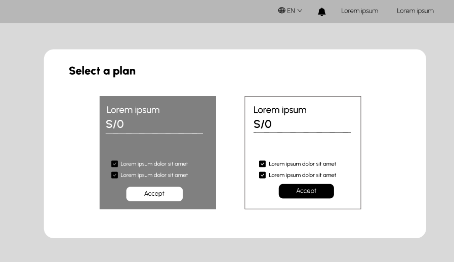
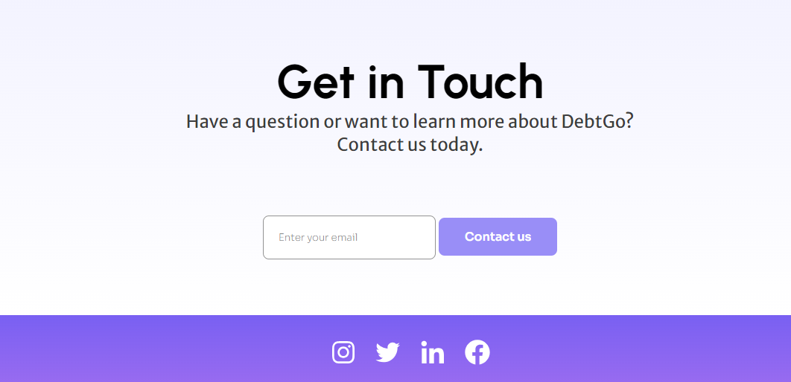

<hr>

# <center>COURSE PROJECT</center>

<p align="center">
    <strong>Universidad Peruana de Ciencias Aplicadas</strong><br>
    </img><br>
    <strong>Ingeniería de Software - 7mo Ciclo</strong><br>
    <strong>Diseño de Experimentos de Ingeniería de Software - 14651</strong><br>
    <strong>Profesor: Juan Carlos Tinoco Licas</strong><br>
    <br>INFORME DE TRABAJO FINAL - TF
</p>

</p>

<p align="center">
    <strong>Startup: DebtGo</strong><br>
    <strong>Producto: Luxus </strong>
</p>

<div style="text-align:center;">
    <h3>Relación de integrantes:</h3>
    <table align="center">
        <tr>
            <th style="text-align:center;">Integrante</th>
            <th style="text-align:center;">Código</th>
        </tr>
        <tr>
            <td>Chavarri Zarzosa, Daniel Jhared</td>
            <td>U202211108</td>
        </tr>
        <tr>
            <td>Peña Riofrio, Maria Fernanda</td>
            <td>U202113279</td>
        </tr>
        <tr>
            <td>Ramos Fuentes Rivera, Adriana Nicole</td>
            <td>U202018427</td>
        </tr>
        <tr>
            <td>Gamarra Vega, Anderson José William</td>
            <td>U202016154</td>
        </tr>
    </table>
</div>

<p align="center">
    <strong>Setiembre, 2025</strong>
</p>
<br>

<h1 align="center">Registro de versiones del Informe</h1>
</br>
<table>
        <thead>
            <tr>
                <th>Versión</th>
                <th>Fecha</th>
                <th>Autor</th>
                <th>Descripción de modificaciones</th>
            </tr>
        </thead>
        <tbody>
            <tr>
                <th>TB1</th>
                <td>20/09/2025</td>
                <td>
                    <ul>
          <li>Daniel Chávarri</li>
          <li>Maria Fernanda Peña</li>
          <li>Adriana Ramos</li>
          <li>Anderson Gamarra</li>
                    <ul>
           </td>
      <td>            
             <ul>
          <li>Capítulo I: Introducción</li>
          <li>Capítulo II: Requirements Elicitation & Analysis</li>
          <li>Capítulo III: Requirements Specification</li>
          <li>Capítulo IV: Product Design</li>
          <li>Capítulo V: Product Implementation</li>
          <li>Avance de Conclusiones, Bibliografía y Anexos</li>
        </ul>
      </td>
  </tr>
</tbody>
</table>

# Contenido
[Student Outcome](#student-outcome)

[Capítulo I: Introducción](#capitulo-i-introducción)
- [1.1. Startup Profile](#11-startup-profile)
  - [1.1.1. Descripción de la Startup](#111-descripción-de-la-startup)
  - [1.1.2. Perfiles de integrantes del equipo](#112-perfiles-de-integrantes-del-equipo)
- [1.2. Solution Profile](#12-solution-profile)
  - [1.2.1 Antecedentes y problemática](#121-antecedentes-y-problemática)
  - [1.2.2 Lean UX Process](#122-lean-ux-process)
    - [1.2.2.1. Lean UX Problem Statements](#1221-lean-ux-problem-statements)
    - [1.2.2.2. Lean UX Assumptions](#1222-lean-ux-assumptions)
    - [1.2.2.3. Lean UX Hypothesis Statements](#1223-lean-ux-hypothesis-statements)
    - [1.2.2.4. Lean UX Canvas](#1224-lean-ux-canvas)
- [1.3. Segmentos objetivo](#13-segmentos-objetivo)

[Capítulo II: Requirements Elicitation & Analysis](#capítulo-ii-requirements-elicitation--analysis)
- [2.1. Competidores](#21-competidores)
  - [2.1.1. Análisis competitivo](#211-análisis-competitivo)
  - [2.1.2. Estrategias y tácticas frente a competidores](#212-estrategias-y-tácticas-frente-a-competidores)
- [2.2. Entrevistas](#22-entrevistas)
  - [2.2.1. Diseño de entrevistas](#221-diseño-de-entrevistas)
  - [2.2.2. Registro de entrevistas](#222-registro-de-entrevistas)
  - [2.2.3. Análisis de entrevistas](#223-análisis-de-entrevistas)
- [2.3. Needfinding](#23-needfinding)
  - [2.3.1. User Personas](#231-user-personas)
  - [2.3.2. User Task Matrix](#232-user-task-matrix)
  - [2.3.3. User Journey Mapping](#233-user-journey-mapping)
  - [2.3.4. Empathy Mapping](#234-empathy-mapping)
  - [2.3.5. As-is Scenario Mapping](#235-as-is-scenario-mapping)
- [2.4. Ubiquitous Language](#24-ubiquitous-language)

[Capítulo III: Requirements Specification](#capítulo-iii-requirements-specification)
- [3.1. To-Be Scenario Mapping](#31-to-be-scenario-mapping)
- [3.2. User Stories](#32-user-stories)
- [3.3. Product Backlog](#33-product-backlog)
- [3.4. Impact Mapping](#34-impact-mapping)

[Capítulo IV: Product Design](#capítulo-iv-product-design)
- [4.1. Style Guidelines](#41-style-guidelines)
  - [4.1.1. General Style Guidelines](#411-general-style-guidelines)
  - [4.1.2. Web Style Guidelines](#412-web-style-guidelines)
  - [4.1.3. Mobile Style Guidelines](#413-mobile-style-guidelines)
  - [4.1.3.1. IOS Mobile Style Guidelines](#4131-ios-mobile-style-guidelines)
  - [4.1.3.2. Android Mobile Style Guidelines](#4132-android-mobile-style-guidelines)
- [4.2. Information Architecture](#42-information-architecture)
  - [4.2.1. Organization Systems](#421-organization-systems)
  - [4.2.2. Labelling Systems](#422-labelling-systems)
  - [4.2.3. SEO Tags and Meta Tags](#423-seo-tags-and-meta-tags)
  - [4.2.4. Searching Systems](#424-searching-systems)
  - [4.2.5. Navigation Systems](#425-navigation-systems)
- [4.3. Landing Page UI Design](#43-landing-page-ui-design)
    - [4.3.1. Landing Page Wireframe](#431-landing-page-wireframe)
    - [4.3.2. Landing Page Mock-up](#432-landing-page-mock-up)
- [4.4. Mobile Applications UX/UI Design](#44-mobile-applications-ux/ui-design)
    - [4.4.1. Mobile Applications Wireframes](#441-mobile-applications-wireframes)
    - [4.4.2. Mobile Applications Wireflow Diagrams](#442-mobile-applications-wireflow-diagrams)
    - [4.4.3. Mobile Applications Mock-ups](#443-mobile-applications-mock-ups)
    - [4.4.4. Mobile Applications User Flow Diagrams](#444-mobile-applications-user-flow-diagrams)
- [4.5. Mobile Applications Prototyping](#45-mobile-applications-prototyping)
    - [4.5.1 Android Mobile Applications Prototyping](#451-android-mobile-applications-prototyping)
    - [4.5.2 IOS Mobile Applications Prototyping](#452-ios-mobile-applications-prototyping)
- [4.6. Web Applications UX/UI Design](#46-web-applications-ux/ui-design)
  - [4.6.1. Web Applications Wireframes](#461-web-applications-wireframes)
  - [4.6.2. Web Applications Wireflow Diagrams](#462-web-applications-wireflow-diagrams)
  - [4.6.3. Web Applications Mock-ups](#463-web-applications-mock-ups)
  - [4.6.4. Web Applications User Flow Diagrams](#464-web-applications-user-flow-diagrams)
- [4.7. Web Applications Prototyping](#47-web-applications-prototyping)
- [4.8. Domain-Driven Software Architecture](#48-domain-driven-software-architecture) 
  - [4.8.1. Software Architecture Context Level Diagramas](#4131-software-architecture-context-level-diagrams)
  - [4.8.2. Software Architecture Container Level Diagrams](#4132-software-architecture-container-level-diagrams)
  - [4.8.3. Software Architecture Components Diagrams](#4133-software-architecture-deployment-diagrams)
- [4.9. Software Object-Oriented Design](#49-software-object-oriented-design)
  - [4.9.1. Class Diagrams](#491-class-diagrams)
  - [4.9.2. Class Dictionary](#492-class-dictionary)
- [4.10. Database Design](#410-database-design)
  - [4.10.1. Relational/No-Relational Database Diagram](#4101-relational/no-relational-database-diagram)

[Capítulo V: Product Implementation](#capítulo-v-solution-ui/ux-design)
- [5.1. Software Configuration Management](#51-software-configuration-management)
    - [5.1.1. Software Development Environment Configuration](#511-software-development-environment-configuration)
    - [5.1.2. Source Code Management](#512-source-code-management)
    - [5.1.3. Source Code Style Guide & Conventions](#513-source-code-guide-&-conventions)
    - [5.1.4. Software Deployment Configuration](#514-software-deployment-configuration)
- [5.2. Product Implementation & Deployment](#52-product-implementation-&-deployment)
    - [5.2.1. Sprint Backlogs](#521-sprint-backlogs)
    - [5.2.2. Implemented Landing Page Evidence](#522-implemented-landing-page-evidence)
    - [5.2.3. Implemented Frontend-Web Application Evidence](#523-implemented-frontend-web-application-evidence)
    - [5.2.4. Implemented Native-Mobile-Application Evidence](#524-implemented-native-mobile-application-evidence)
    - [5.2.5. Implemented RESTful API and/or Serverless Backend Evidence](#525-implemented-restful-api-and/or-serverless-backend-evidence)
    - [5.2.6. RESTful API documentation](#526-restful-api-documentation)
    - [5.2.7. Team Collaboration Insights](#527-team-collaboration-insights)
 - [5.3. Video About-the-Product](#53-video-about-the-product)
      
[Capítulo VI: Product Implementation, Validations & Deployment](#capítulo-vi-product-implementation-validations-&-deployment)
- [6.2. Landing Page & Mobile Application Implementation](#62-landing-page-&-mobile-application-implementation)
- [6.2.1. Sprint n](#621-sprint-n)
    - [6.2.1.1. Sprint Planning n](#6211-sprint-planning-n)
    - [6.2.1.2. Sprint Backlog n](#6212-sprint-backlog-n)
    - [6.2.1.3. Development Evidence for Sprint Review](#6213-development-evidence-for-sprint-review)
    - [6.2.1.4. Testing Suite Evidence for Sprint Review](#6214-testing-suite-evidence-for-sprint-review)
    - [6.2.1.5. Execution Evidence for Sprint Review](#6215-execution-evidence-for-sprint-review)
    - [6.2.1.6. Services Documentation Evidence for Sprint Review](#6216-services-documentation-evidence-for-sprint-review)
    - [6.2.1.7. Software Deployment Evidence for Sprint Review](#6217-software-deployment-evidence-for-sprint-review)
    - [6.2.1.8. Team Collaboration Insights during Sprint](#6218-team-collaboration-insights-during-sprint)
- [6.3. Validation Interviews](#63-validation-interviews)
- [6.3.1. Diseño de Entrevistas](#631-diseño-de-entrevistas)
- [6.3.2. Registro de Entrevistas](#632-registro-de-entrevistas)
- [6.3.3. Evaluaciones según Heurísticas](#633-evaluaciones-según-heurísticas)
- [6.4. Video About-the-Product](#64-video-about-the-product)    

[Conclusiones](#conclusiones)
- [Conclusiones y recomendaciones](#conclusiones-y-recomendaciones)
- [Video About-the-Team](#video-about-the-team)

[Bibliografía](#bibliografía)

[Anexos](#anexos)

# Student Outcome
ABET – EAC - Student Outcome 4

Criterio: La capacidad de reconocer responsabilidades éticas y profesionales en situaciones de Ingeniería y hacer juicios informados, que deben considerar el impacto de las soluciones de ingeniería en contextos globales, económicos, ambientales y sociales.

<table>
  <tr>
    <td><b>Criterio específico</b></td>
    <td><b>Acciones realizadas</b></td>
    <td><b>Conclusiones</b></td>
  </tr>
    </thead>
  <tbody>
    <tr>
      <td><b>4.c.1 Reconoce responsabilidad ética y profesional en situaciones de ingeniería de software</b></td>
      <td>
        <p><b>Chávarri Zarzosa, Daniel Jhared</b></p>
        <p><b>TB1:</b></p>
        <p>Hice el Capítulo I, Capítulo II, Capítulo III y Capítulo IV, de igual manera, me aseguré de que todo vaya de acorde a los puntos indicados para la tb1.</p>
        <p><b>Peña Riofrio, Maria Fernanda</b></p>
       <p><b>TB1:</b></p>
        <p>...</p>
        <p><b>Ramos Fuentes Rivera, Adriana Nicole</b></p>
        <p><b>TB1:</b></p>
        <p>...</p>
        <p><b>Gamarra Vega, Anderson José William</b></p>
       <p><b>TB1:</b></p>
        <p>...</p>
      </td>
      <td>
        <p><strong>TB1:</strong></p>
        <p>...</p>
      </td>
    </tr>
    <tr>
      <td>4.c.2 Emite juicios informados considerando el impacto de las soluciones de ingeniería de software en contextos globales, económicos, ambientales y sociales</td>
      <td>
        <p><b>Chávarri Zarzosa, Daniel Jhared</b></p>
        <p><b>TB1:</b></p>
        <p>Hice el Capítulo I, Capítulo II, Capítulo III y Capítulo IV, de igual manera, me aseguré de que todo vaya de acorde a los puntos indicados para la tb1.</p>
        <p><b>Peña Riofrio, Maria Fernanda</b></p>
       <p><b>TB1:</b></p>
        <p>...</p>
        <p><b>Ramos Fuentes Rivera, Adriana Nicole</b></p>
       <p><b>TB1:</b></p>
        <p>...</p>
        <p><b>Gamarra Vega, Anderson José William</b></p>
       <p><b>TB1:</b></p>
        <p>...</p>
      </td>
       <td>
        <p><strong>TB1:</strong></p>
        <p>...</p>
      </td>
    </tr>
  </tbody>
</table>

# Capítulo I: Introducción
## 1.1. Startup Profile
### 1.1.1. Descripción de la Startup

DebtGo es una aplicación que revoluciona la manera en que las personas acceden a préstamos empresariales y manejan sus deudas personales. Esta startup impulsa la implementación de una aplicación intuitiva, brindando a los usuarios las herramientas necesarias para gestionar sus deudas de manera efectiva y mejorar su conocimiento financiero. La aplicación ofrece herramientas avanzadas para la gestión de deudas, seguimiento de ingresos y gastos, y el asesoramiento personalizado por parte de consultores financieros expertos.

Hoy en día las obligaciones económicas desde muy temprana edad son una realidad y DebtGo es el mejor aliado para ayudar tanto a jóvenes empresarios como a personas con deudas personales a gestionar sus finanzas y economía para gozar de un bienestar financiero.

Nuestro modelo de negocio digital se centra principalmente en ofrecer servicios de consultoría financiera personalizada y talleres en línea, que los usuarios pueden adquirir por una tarifa adicional. Estos servicios permiten a los usuarios recibir asesoramiento adaptado a sus necesidades específicas y participar en sesiones educativas especializadas. Además, ofrecemos un servicio de suscripción, donde los usuarios pagan una tarifa mensual o anual para acceder a características premium, como análisis financieros detallados, planes de pago personalizados, y contenido educativo exclusivo. Este enfoque diversificado garantiza que DebtGo sea independiente y sostenible, proporcionando un flujo de ingresos continuo mientras se centra en la creación de valor para el usuario.

DebtGo no se basa en el comercio electrónico ni en la publicidad, sino que permite mantener una experiencia de usuario limpia y enfocada en el bienestar financiero. Además, el componente innovador del modelo radica en la personalización avanzada de los presupuestos y recomendaciones financieras adaptadas a las necesidades y hábitos de gasto de los usuarios, lo que distingue DebtGo de otras aplicaciones en el mercado.

A manera de escalabilidad, proponemos introducir a futuro el uso de inteligencia artificial para personalizar aún más las recomendaciones financieras y proveer retroalimentación a los usuarios en su progreso educativo.

### 1.1.2. Perfiles de integrantes del equipo
<table>
  <tr>
    <th>
      
    </th>
    <td valign="top">
      <p><b>Chávarri Zarzosa, Daniel Jhared</b></p>
      <p>
       Soy estudiante de la UPC, tengo 20 años. Estoy en la carrera de Ingeniería de Software, ya que, siempre me gustó la tecnología, los videojuegos, las páginas web, pero sobre todo 
       cómo crearlos. Estoy cursando el 6 ciclo de la carrera y mis habilidades son C++, Python, HTML y JavaScript. También soy bueno en ser responsable con cada curso y organizar mi 
       tiempo en ellos.
      </p>
    </td>
  </tr>
   <tr>
    <th>
      
    </th>
    <td valign="top">
      <p><b>Peña Riofrio, Maria Fernanda</b></p>
      <p>
        ...
      </p>
    </td>
  </tr>
     <tr>
    <th>
      
    </th>
    <td valign="top">
      <p><b>Ramos Fuentes Rivera, Adriana Nicole</b></p>
      <p>
      ...
      </p>
    </td>
  </tr>
     <tr>
    <th>
      
    </th>
    <td valign="top">
      <p><b>Gamarra Vega, Anderson José William</b></p>
      <p>
          ...
      </p>
    </td>
  </tr>
</table>

## 1.2. Solution Profile
### 1.2.1 Antecedentes y problemática

Muchas personas enfrentan la falta de conocimiento y claridad en relación con el estado de sus finanzas, lo cual es un problema que afecta a una gran parte de la población. Esta situación no solo se debe a la falta de educación financiera, sino también a la complejidad con la que a menudo se presentan los términos y condiciones de los productos crediticios. Como resultado, muchas personas desconocen no solo las fuentes exactas de sus deudas, sino también los montos originales, los intereses acumulados, y las posibles penalidades por pagos tardíos o incumplimientos. Por otro lado, los emprendedores enfrentan el desafío de los préstamos bancarios, sus condiciones y lo que implica pagar estos préstamos de vuelta, o no pagarlos a tiempo.  

Esta falta de información clara y accesible puede llevar a situaciones en las que los individuos no recuerdan cuándo adquirieron una deuda específica, cómo se calcularon los intereses o qué entidad financiera está gestionando sus pagos. Además, la carencia de recordatorios efectivos o herramientas que faciliten la gestión de sus obligaciones financieras puede hacer que las personas pierdan de vista las fechas de vencimiento de los pagos, lo que a su vez incrementa el riesgo de caer en mora. Este desconocimiento no solo afecta su historial crediticio, sino que también puede generar estrés significativo, impactos negativos en su salud mental y dificultades en su vida cotidiana.

A medida que las deudas se acumulan y se vuelven más difíciles de manejar, muchas personas se encuentran atrapadas en un ciclo de endeudamiento, donde la falta de claridad y organización agrava su situación financiera. Esto puede llevar a tomar decisiones desesperadas, como adquirir nuevas deudas para pagar las existentes, lo que finalmente incrementa la carga financiera y perpetúa un círculo vicioso de deuda. Es fundamental abordar este problema mediante la educación financiera, la transparencia en la información proporcionada por las instituciones crediticias, y el desarrollo de herramientas que permitan a los usuarios gestionar y entender mejor sus deudas. Solo así se podrá reducir la incidencia de problemas financieros graves y mejorar la calidad de vida de las personas afectadas.

**5Ws y 2Hs:**

**Qué:** La falta de educación financiera en el público general conlleva a varios problemas en el futuro de las personas, y afecta sus prospectos al momento de adquirir préstamos - sean estos préstamos personales o empresariales. DebtGo es una aplicación innovadora que proporciona a los usuarios una plataforma para interactuar directamente con consultores financieros expertos, que ofrecen atención personalizada a los casos específicos de cada usuario. Adicionalmente, cuenta con herramientas avanzadas para comprender, monitorear y gestionar sus deudas de manera intuitiva, mientras fortalecen su educación financiera. Ofrece funcionalidades como la creación de presupuestos personalizados, seguimiento de ingresos y gastos, y acceso a contenido educativo.

**Quién:** Está dirigida a dos segmentos principales: consultores financieros, y emprendedores. El primer segmento está comprendido por jóvenes profesionales, entre 20-30 años, que están entrando en el mercado laboral en carreras de finanzas. El segundo segmento abarca a emprendedores que requieren soluciones efectivas para manejar la adquisición de préstamos, deudas y mejorar su flujo de efectivo.

**Dónde:** El problema nace de la falta de educación financiera, lo que afecta a las personas a largo plazo, y se observa más comúnmente en la creación de deudas por falta de pagos

**Cuándo:** Este problema se visualiza durante los procesos de obtención de préstamos y cancelación de deudas, lo que para varios de los afectados, ocurre una vez el problema ha existido por largo tiempo, y lo hace más difícil revertir.

**Por qué:** La falta de conocimiento financiero y la complejidad en la gestión de deudas lleva a muchas personas a enfrentar estrés y dificultades financieras debido a la falta de claridad en sus obligaciones crediticias, lo que puede llevar a decisiones financieras deficientes y un ciclo de endeudamiento. La aplicación ofrece una solución integral para mejorar el bienestar financiero.

**Cómo:** La falta de educación financiera lleva a las personas a tomar decisiones desinformadas, lo que a su vez afecta su bienestar económico. Algunas de las consecuencias más comunes son la acumulación de deudas y la pérdida de ahorros. Esta situación de inestabilidad financiera impide alcanzar oportunidades y beneficios futuros. Mejorar la educación financiera es clave para romper estos patrones.

**Cuánto:** Miles de personas enfrentan problemas financieros por falta de educación financiera todos los días. En Estados Unidos, por ejemplo, la deuda total de tarjetas de crédito supera el trillón de dólares, y el consumidor promedio tiene más de $6000 de deuda. Mejorar la educación financiera es crucial para minimizar la brecha creada por este problema.


### 1.2.2 Lean UX Process
#### 1.2.2.1. Lean UX Problem Statements

Nuestra aplicación, DebtGo, está diseñada para ofrecer a los usuarios una herramienta poderosa que les permita gestionar sus deudas de manera efectiva, al mismo tiempo que fortalece su educación financiera. DebtGo se presenta como una oportunidad para que los usuarios mejoren su situación financiera, adoptando hábitos saludables que les permitan alcanzar sus objetivos económicos y evitar el ciclo de endeudamiento.

Sin embargo, hemos identificado ciertos factores que podrían ser desafíos significativos para la adopción de nuestra aplicación. Uno de los principales retos es la desconfianza que algunos usuarios pueden tener hacia una nueva empresa tecnológica. Esta desconfianza podría surgir del temor a que la aplicación no cumpla con sus expectativas o que no proporcione los resultados prometidos.

Ante estos desafíos, es crucial que abordemos las siguientes preguntas:

¿Cómo podemos construir confianza y credibilidad entre nuestros usuarios potenciales? Es fundamental demostrar que DebtGo es una herramienta confiable, segura y efectiva para la gestión de deudas. Estrategias como testimonios de usuarios, demostraciones de resultados tangibles, y certificaciones pueden ser claves para eliminar esta desconfianza.

¿Qué tan esencial es una aplicación de educación financiera en el contexto actual? Considerando el aumento del endeudamiento y la falta de educación financiera en diversos segmentos de la población, es primordial mostrar cómo DebtGo no solo facilita la gestión de deudas, sino que también empodera a los usuarios mediante el conocimiento, ayudándoles a tomar decisiones financieras informadas.

¿Cómo podemos motivar a las personas a reconocer el valor de nuestra aplicación? Es necesario comunicar claramente los beneficios y el impacto positivo que DebtGo puede tener en la vida financiera de los usuarios. El uso de casos de éxito, la oferta de pruebas gratuitas, y la integración de contenido educativo relevante pueden motivar a los usuarios a probar y adoptar la aplicación como una herramienta esencial en su vida diaria.

Al abordar estas preguntas de manera proactiva, buscamos no solo atraer a usuarios a DebtGo, sino también convertirnos en un aliado confiable en su camino hacia la estabilidad y el bienestar financiero.

#### 1.2.2.2. Lean UX Assumptions

1. Nuestros clientes una aplicación que no solo les ayude a gestionar sus deudas de manera efectiva, sino que también les ofrezca herramientas y recursos educativos para mejorar su 
   conocimiento financiero. DebtGo está diseñada para facilitar este proceso, permitiendo a los usuarios tomar el control de su situación financiera con mayor confianza y seguridad.

2. La aplicación busca empoderar a los jóvenes adultos con las habilidades necesarias para gestionar sus deudas y mejorar su educación financiera. La aplicación no solo les 
   proporcionará las herramientas para administrar sus finanzas, sino que también los educará sobre conceptos clave que les ayudarán a evitar futuras dificultades financieras.

3. Los usuarios iniciales de DebtGo serán personas mayores de 18 años que buscan una solución intuitiva y educativa para gestionar sus deudas. Este grupo incluye tanto a jóvenes adultos 
   que recién están comenzando a asumir responsabilidades financieras como a personas que desean mejorar su control sobre sus finanzas personales.

4. DebtGo planea generar ingresos a través de un modelo premium, donde los usuarios pueden acceder a funciones avanzadas mediante una suscripción. Esto nos permitirá monetizar a medida 
   que crece la base de usuarios y estos reconocen el valor adicional de las funciones premium.

5. Adquiriremos la mayoría de nuestros clientes a través de alianzas estratégicas con instituciones educativas, universidades, y organizaciones sin fines de lucro que promueven la 
   educación financiera. Ofreceremos seminarios y talleres gratuitos sobre gestión de deudas y finanzas personales, integrando el uso de DebtGo como una herramienta clave en estos 
   programas. Además, lanzaremos campañas de sensibilización en comunidades y foros en línea especializados en finanzas personales, donde podremos interactuar
   directamente con nuestro público objetivo, ofreciendo demostraciones y acceso a recursos exclusivos dentro de la aplicación.

6. Nuestra competencia incluye otras aplicaciones de gestión de deudas y educación financiera que ya están establecidas en el mercado. Sin embargo, DebtGo se diferencia por su enfoque 
   en la simplicidad, la personalización, y la educación financiera continua, que juntas ofrecen una experiencia única y valiosa para los usuarios.

7. Superaremos a nuestra competencia ofreciendo una aplicación que es altamente intuitiva y eficiente, diseñada para ser accesible incluso para aquellos sin conocimientos tecnológicos 
   avanzados. Además, la personalización de los planes de pago y la oferta de contenido educativo relevante nos posicionarán como la opción preferida entre los usuarios.

8. El mayor riesgo para DebtGo radica en la fuerte competencia en el mercado, lo que podría afectar nuestra rentabilidad. Con tantas opciones disponibles, los usuarios pueden optar por 
   aplicaciones más conocidas, lo que dificultará nuestra penetración y crecimiento en el mercado.

9. Para mitigar los riesgos, realizaremos un análisis exhaustivo de las fortalezas y debilidades de nuestra aplicación en comparación con las de la competencia. Utilizaremos esta 
   información para mejorar continuamente DebtGo, enfocándonos en optimizar la experiencia del usuario, ampliar la funcionalidad, y fortalecer nuestra propuesta de valor, asegurando así 
   la calidad y rentabilidad de la aplicación.

#### 1.2.2.3. Lean UX Hypothesis Statements

Creemos que al implementar más herramientas de notificaciones en la aplicación DebtGo, brindaremos a los usuarios alertas más eficaces sobre sus pagos pendientes. Éxito: Sabremos que hemos tenido éxito cuando el 80% de las llamadas registradas no presenten deudas pendientes.

Creemos que al añadir un mecanismo de categorización que permita a los usuarios seleccionar si son empresas o particulares, y que ajuste las funcionalidades de la aplicación según esa selección, mejoraremos la experiencia del usuario. Éxito: Sabremos que hemos tenido éxito cuando el 100% de los usuarios y empresas estén registrados formalmente en la plataforma.

Creemos que al ofrecer recompensas a los usuarios que paguen sus deudas de forma anticipada y sin retrasos, incentivaremos un comportamiento de pago puntual. Éxito: Sabremos que hemos tenido éxito cuando el porcentaje de deudas hacia la empresa disminuya en un 35%.

Creemos que al registrar de manera precisa a los usuarios que pagan y a los que no, reduciremos las llamadas innecesarias y optimizaremos el uso del tiempo. Éxito: Sabremos que hemos tenido éxito cuando el registro de usuarios de las empresas aumente en un 65%.

Creemos que la falta de actualizaciones o implementaciones de software tempranas en la aplicación afectará negativamente la gestión de deudas. Fracaso: Sabremos que hemos fracasado cuando las deudas de las empresas aumenten en un 25%.

Creemos que al no contar con un sistema de seguridad actualizado y moderno en nuestra aplicación, seremos vulnerables a ataques cibernéticos o intentos de hackeo. Fracaso: Sabremos que hemos fracasado cuando los ataques cibernéticos al sistema DebtGo aumenten en un 48%.

#### 1.2.2.4. Lean UX Canvas

 

 *Imagen (N°1). Elaboración propia. Realizado en Canva*

## 1.3. Segmentos objetivo

<strong>1. Consultores financieros:</strong>

Descripción: Este segmento incluye a jóvenes jóvenes profesionales, que se encuentran entrando al mercado laboral, o que se encuentren en los últimos ciclos de la universidad para carreras de finanzas, economía y afines. (20-30 años). Estas personas van a estar interesadas en adquirir ganancias extras y adquirir experiencia relevante en el mercado laboral.

Necesidades Satisfechas: DebtGo les ofrece la oportunidad para comprartir sus conocimientos de manera flexible y conveniente, mientras adquieren experiencia en el sector de consultoría que pueden utilizar para ampliar sus experiencias y habilidades al momento de aplicar para otros empleos en el futuro.

<strong>2. Emprendedores</strong>
   
Descripción: Este segmento abarca a personas con emprendedimientos o propietarios de pequeñas empresas, y aquellos que necesitan préstamos para iniciar o expandir sus negocios. Estos individuos enfrentan situaciones financieras apremiantes y buscan soluciones rápidas y efectivas para gestionar sus negocios, sus deudas y mejorar su flujo de efectivo.

Necesidades Satisfechas: DebtGo les proporciona una plataforma centralizada para gestionar y consolidar sus deudas, crear planes de pago personalizados, y evitar el pago de intereses adicionales. Además, se ofrece el servicio de consultoría personalizada con consultores financieros expertos, que tienen experiencia en el rubro y la habilidad para ayudar a estos emprendedores a realizar sus objetivos.

# Capítulo II: Requirements Elicitation & Analysis 

## 2.1. Competidores

Comprender el panorama competitivo es crucial para el éxito de DebtGo. En esta sección, identificaremos y describiremos a nuestros principales competidores directos e indirectos que operan en el ámbito de la gestión de deudas y la educación financiera. Analizaremos sus modelos de negocio, estrategias de marketing, productos y servicios, y los canales de distribución que utilizan. Además, realizaremos un análisis comparativo detallado de sus fortalezas, debilidades, oportunidades y amenazas (SWOT) en relación con DebtGo. Este análisis nos permitirá entender mejor el entorno competitivo y ajustar nuestras estrategias para maximizar nuestra ventaja en el mercado.

1. Mint (Intuit): Mint es una aplicación popular para la gestión de finanzas personales que ofrece seguimiento de gastos, presupuestos y alertas financieras. Es conocida por su interfaz intuitiva y sus capacidades de agregación de datos financieros.

2. You Need a Budget (YNAB): YNAB se centra en la creación de presupuestos y la gestión de finanzas personales mediante un enfoque basado en la asignación de cada dólar a una tarea específica. Ofrece herramientas para planificar el gasto y gestionar las deudas.

3. Credit Karma: Credit Karma ofrece herramientas para el seguimiento del crédito, la gestión de deudas y la comparación de productos financieros. Aunque su enfoque principal es el monitoreo del crédito, también proporciona recomendaciones para la gestión de deudas.

## 2.1.1. Analisis competitivo

El análisis competitivo implica examinar detenidamente a nuestros competidores para identificar sus fortalezas, debilidades, oportunidades y amenazas. Esto nos proporcionará una visión clara de nuestro posicionamiento en el mercado y nos ayudará a desarrollar estrategias efectivas.

<table>
  <tr>
    <th colspan="7" valign="top"><b>Competitive Analysis Landscape</b></th>
  </tr>
  <tr>
    <td colspan="2" rowspan="2">¿Por qué llevar a cabo este análisis?</td>
    <td colspan="5">Escriba en el recuadro la pregunta que busca responder o el objetivo de este análisis.</td>
  </tr>
  <tr>
    <td colspan="5">El análisis competitivo es fundamental para entender el entorno en el que DebtGo opera, identificar las fortalezas y debilidades de los competidores, y descubrir oportunidades y amenazas en el mercado. Este análisis ayuda a posicionar mejor nuestra startup en relación con los competidores y a definir estrategias que maximicen nuestra ventaja competitiva.</td>
  </tr>
  <tr>
    <td colspan="3">Nombre y Logo</td>
    <td colspan="1" valign="top" style="font-weight: bold;">
        DebtGo
        <br>
        <div style="text-align: center; margin-top: 10px;">
                </img>
        </div>
    <td colspan="1" valign="top" style="font-weight: bold;">
    Mint
    <div style="text-align: center;">
                </img>
        </div>
    </td>
    <td colspan="1" valign="top" style="font-weight: bold;">
      YNAB
      <div style="text-align: center; margin-top: 20px;">
                </img>
            </div>
      </td>
    <td colspan="1" valign="top" style="font-weight: bold;" >
      Credit Karma
      <div style="text-align: center; margin-top: 10px;">
                </img>
            </div>
    </td>
  </tr>
  <tr>
    <td colspan="1" rowspan="2"><p>Perfil</p></td>
    <td colspan="2">Overview</td>
    <td colspan="1" valign="top">Aplicación para gestionar deudas y educación financiera. Ofrece herramientas para seguimiento de ingresos, gastos y presupuestos.</td>
    <td colspan="1" valign="top">Plataforma para gestión de finanzas personales con seguimiento de gastos y presupuestos.</td>
    <td colspan="1" valign="top">Herramienta enfocada en la creación de presupuestos y asignación de fondos.</td>
    <td colspan="1" valign="top">Servicio de monitoreo de crédito con herramientas de gestión de deudas y recomendaciones financieras.</td>
  </tr>
  <tr>
    <td colspan="2">Ventaja competitiva¿Qué valor ofrece a los clientes?</td>
    <td colspan="1" valign="top">Personalización avanzada de presupuestos y recomendaciones financieras.</td>
    <td colspan="1" valign="top">Amplia integración con cuentas bancarias y tarjetas.</td>
    <td colspan="1" valign="top">Enfoque en la metodología de presupuesto y planificación.</td>
    <td colspan="1" valign="top">Monitoreo de crédito gratuito y recomendaciones personalizadas.</td>
  </tr>
  <tr>
    <td colspan="1" rowspan="2"><p>Perfil de Marketing</p></td>
    <td colspan="2">Mercado objetivo</td>
    <td colspan="1" valign="top">Jóvenes y adultos que desean mejorar su educación financiera y gestionar sus deudas.</td>
    <td colspan="1" valign="top">Usuarios interesados en el seguimiento de gastos y la gestión financiera.</td>
    <td colspan="1" valign="top">Personas que buscan un enfoque riguroso en la creación y seguimiento de presupuestos.</td>
    <td colspan="1" valign="top">Usuarios que desean monitorear su crédito y gestionar deudas.</td>
  </tr>
  <tr>
    <td colspan="2">Estrategias de marketing</td>
    <td colspan="1" valign="top">Marketing digital dirigido a usuarios interesados en finanzas personales.</td>
    <td colspan="1" valign="top">Publicidad a través de canales digitales y colaboraciones con influencers financieros.</td>
    <td colspan="1" valign="top">Marketing basado en testimonios y demostraciones del enfoque de presupuesto.</td>
    <td colspan="1" valign="top">Publicidad a través de contenido educativo sobre crédito y finanzas personales.</td>
  </tr>
  <tr>
    <td colspan="1" rowspan="3"><p>Perfil de Producto</p></td>
    <td colspan="2">Productos & Servicios</td>
    <td colspan="1" valign="top">Aplicación móvil con suscripción para características premium y servicios de consultoría financiera personalizada.</td>
    <td colspan="1" valign="top">Aplicación gratuita con opciones premium para características avanzadas.</td>
    <td colspan="1" valign="top">Suscripción mensual para acceso a herramientas de presupuesto y planificación.</td>
    <td colspan="1" valign="top">Aplicación gratuita con características premium para monitoreo avanzado y recomendaciones.</td>
  </tr>
  <tr>
    <td colspan="2">Precios & Costos</td>
    <td colspan="1" valign="top">Tarifa mensual o anual para suscripción premium, tarifas adicionales para consultoría y talleres.</td>
    <td colspan="1" valign="top">Gratuita con opciones de pago para características adicionales.</td>
    <td colspan="1" valign="top">Suscripción mensual o anual.</td>
    <td colspan="1" valign="top">Gratuita con opciones de pago para características avanzadas.</td>
  </tr>
  <tr>
    <td colspan="2">Canales de distribución (Web y/o Móvil)</td>
    <td colspan="1" valign="top">Web y móvil (iOS y Android).</td>
    <td colspan="1" valign="top">Web y móvil (iOS y Android).</td>
    <td colspan="1" valign="top">Web y móvil (iOS y Android).</td>
    <td colspan="1" valign="top">Web y móvil (iOS y Android).</td>
  </tr>
  <tr>
    <td colspan="1" rowspan="5"><p>Análisis SWOT</p></td>
    <td colspan="6">Realice esto para su startup y sus competidores. Sus fortalezas deberían apoyar sus oportunidades y contribuir a lo que ustedes definen como su posible ventaja competitiva.</td>
  </tr>
  <tr>
    <td colspan="2">Fortalezas</td>
    <td colspan="1" valign="top">Innovación en personalización y enfoque en educación financiera.</td>
    <td colspan="1" valign="top">Amplia integración con bancos y tarjetas.</td>
    <td colspan="1" valign="top">Método comprobado de asignación de presupuesto.</td>
    <td colspan="1" valign="top">Monitoreo de crédito gratuito y recomendaciones personalizadas.</td>
  </tr>
  <tr>
    <td colspan="2">Debilidades</td>
    <td colspan="1" valign="top">Falta de reconocimiento de marca en comparación con competidores establecidos.</td>
    <td colspan="1" valign="top">Dependencia de ingresos por publicidad y promociones.</td>
    <td colspan="1" valign="top">Curva de aprendizaje en la metodología de presupuesto.</td>
    <td colspan="1" valign="top">Limitación en la profundidad del análisis de finanzas más allá del crédito.</td>
  </tr>
  <tr>
    <td colspan="2">Oportunidades</td>
    <td colspan="1" valign="top">Creciente interés en la educación financiera y gestión de deudas.</td>
    <td colspan="1" valign="top">Expansión en mercados internacionales.</td>
    <td colspan="1" valign="top">Integración de características adicionales basadas en IA.</td>
    <td colspan="1" valign="top">Expansión en servicios de planificación financiera.</td>
  </tr>
  <tr>
    <td colspan="2">Amenazas</td>
    <td colspan="1" valign="top">Competencia creciente y posibles cambios en regulaciones financieras.</td>
    <td colspan="1" valign="top">Competencia de aplicaciones de finanzas personales más integrales.</td>
    <td colspan="1" valign="top">Competencia de plataformas con características similares.</td>
    <td colspan="1" valign="top">Cambios en regulaciones de crédito y competencia de herramientas de gestión financiera.</td>
  </tr>
</table>

## 2.1.2. Estrategias y tácticas frente a competidores

Desarrollar estrategias y tácticas sólidas para enfrentar a nuestros competidores es fundamental para alcanzar una ventaja competitiva sostenible. En esta sección, exploraremos cómo podemos diferenciarnos y destacarnos en el mercado.

<strong>Estrategias y Tácticas Preliminares de DebtGo:</strong>

#1 Diferenciación a través de Persoanlización Avanzada:
- **Estrategia:** Posicionar a DebtGo como la opción más avanzada en personalización de presupuestos y recomendaciones financieras.
- **Táctica:** Desarrollar y promocionar funcionalidades de inteligencia artificial que ofrezcan recomendaciones financieras ultra-personalizadas. Realizar campañas de marketing que destaquen esta capacidad única y cómo se traduce en mejores resultados financieros para los usuarios.

#2 Enfoque en Educación Financiera:
- **Estrategia:** Aprovechar el interés creciente en la educación financiera para atraer usuarios que buscan mejorar su bienestar financiero a través de conocimientos prácticos y personalizados.
- **Táctica:** Ofrecer contenido educativo exclusivo y talleres interactivos como parte del paquete premium. Publicar estudios de caso y testimonios de usuarios que han logrado mejorar sus finanzas utilizando DebtGo.

#3 Optimización de la Experiencia de Usuario (UX):
- **Estrategia:** Garantizar que la experiencia de usuario sea superior y sin distracciones, en comparación con competidores que dependen de modelos basados en publicidad.
- **Táctica:** Implementar una interfaz de usuario intuitiva y realizar pruebas continuas para optimizar la navegación y la usabilidad. Recolectar y analizar feedback de usuarios para realizar mejoras continuas.

#4 Innovación Tecnológica:
- **Estrategia:** Utilizar la tecnología de vanguardia para mantener una ventaja competitiva y diferenciarse en el mercado.
- **Táctica:** Invertir en el desarrollo de tecnologías emergentes, como el aprendizaje automático y la inteligencia artificial, para ofrecer características innovadoras que los competidores aún no tienen. Lanzar nuevas funcionalidades en fases para mantener el interés y la retención de los usuarios.
 
#5 Vigilancia y Adaptación Continua:
- **Estrategia:** Monitorear continuamente el panorama competitivo para adaptar las estrategias y tácticas en función de las tendencias y cambios del mercado.
- **Tácticas:** Establecer un equipo dedicado a la investigación competitiva y al análisis del mercado. Ajustar las estrategias de marketing y producto basadas en la evolución de las ofertas de los competidores y las expectativas de los usuarios.

Estas estrategias y tácticas nos ayudarán a posicionar a DebtGo de manera efectiva en el mercado, aprovechando sus fortalezas y oportunidades mientras se enfrentan a las debilidades y amenazas que presentan los competidores.

## 2.2. Entrevistas
### 2.2.1. Diseño de entrevistas

**Segmento Objetivo: Consultores financieros:**

1. ¿Cuál es su nombre completo?
2. ¿Cuál es su edad?
3. ¿En qué distrito reside actualmente?
4. ¿Cuál es su ocupación/profesión y cuántos años de experiencia tiene en el campo de la economía o la consultoría financiera?
5. ¿Está familiarizado con el término "educación financiera"? ¿Cómo lo definiría en su propio contexto profesional?
6. ¿Qué dispositivos tecnológicos utiliza con mayor frecuencia en su trabajo diario? ¿Cuál considera más esencial para su actividad profesional?
7. ¿Qué redes sociales utiliza para mantenerse actualizado en temas financieros o económicos? ¿Cómo las utiliza en su práctica profesional?
8. ¿Ha visto algún tipo de anuncio o promoción relacionada con aplicaciones de gestión financiera en su dispositivo? ¿Cuál fue su impresión?
9. ¿En su rol actual, gestiona o asesora sobre responsabilidades económicas de empresas o individuos? ¿Podría darme un ejemplo?
10. ¿Conoce INFOCORP u otras bases de datos de informes crediticios? ¿Qué importancia les da en su práctica profesional?
11. ¿Qué desafíos ve en la gestión de finanzas personales de sus clientes o en su propia vida financiera?
12. ¿Ha utilizado o recomendado alguna aplicación para la gestión de finanzas personales o empresariales? ¿Qué características le parecen más útiles?
13. En su opinión, ¿cuál es la necesidad más importante en la educación financiera de las personas actuales? ¿Cómo cree que una app como DebtGo podría abordar esta necesidad?
14. ¿Considera que una aplicación de gestión financiera personalizada puede tener un impacto significativo en la mejora de las finanzas personales de los usuarios? ¿Por qué sí o por qué no?

**Segmento Objetivo: Gestores de Deudas y Emprendedores**

1. ¿Cuál es su nombre completo?
2. ¿Cuál es su edad?
3. ¿En qué distrito reside actualmente?
4. ¿Qué tipo de empresa estás interesado en iniciar?
5. ¿Cuál es tu nivel de conocimiento de finanzas? 
6. ¿Has trabajado con consultores financieros anteriormente? ¿Crees que deberían tener experiencia en tu rubro para poder asesorarte?
7. ¿Tienes alguna experiencia en la obtención de préstamos?
8. ¿Está familiarizado con términos financieros como crédito, interés, liquidez, etc.? 
9. ¿Qué pasos en el proceso de la obtención de préstamos resultan más confusos?
10. ¿Qué te preocupa más al momento de solicitar préstamos para tu negocio? (ie.  interés, condiciones, etc)
11. ¿A qué plataformas consideras acudir para adquirir préstamos? ¿Por qué?
12. ¿Qué criterios utilizas para identificar si una publicidad de préstamos es real, o si es un intento de estafa?
13. ¿Utilizas aplicaciones de banca móvil? ¿Cómo te sientes acerca del nivel de seguridad ofrecido por estas aplicaciones?
14. ¿A qué nivel estarías dispuesto a compartir tus datos financieros en una aplicación de consultas financieras?
15. ¿Qué condiciones o garantías lo harían sentir más seguro al momento de compartir información financiera?

### 2.2.2. Registro de entrevistas

**Segmento Objetivo: Consultores financieros:**

**Entrevista #1**

- Nombre: George Garcia Durand
- Edad: 20 años
- Distrito: Rimac
- Duración: 4:57


[Entrevista 1 - video](https://upcedupe-my.sharepoint.com/:v:/g/personal/u202214214_upc_edu_pe/EQ77TmeMzZxLv83IOvsXFtMBa3PM7kygfpVsY93jZnukZg?nav=eyJyZWZlcnJhbEluZm8iOnsicmVmZXJyYWxBcHAiOiJTdHJlYW1XZWJBcHAiLCJyZWZlcnJhbFZpZXciOiJTaGFyZURpYWxvZy1MaW5rIiwicmVmZXJyYWxBcHBQbGF0Zm9ybSI6IldlYiIsInJlZmVycmFsTW9kZSI6InZpZXcifX0%3D&e=ReJpXc)

Resumen:
En la entrevista realizada a George Garcia Durand , graduado en finanzas de 20 años y residente en Rímac, se abordaron temas relacionados a la gestión financiera personal y empresarial. George destacó la importancia de la educación financiera para tomar decisiones informadas sobre el manejo del dinero y señaló que su herramienta principal de trabajo es la laptop, aunque también utiliza su celular. Se actualiza en temas financieros a través de LinkedIn, Twitter y YouTube. Comentó que, aunque es escéptico respecto a muchas aplicaciones de finanzas debido a la publicidad engañosa, ha utilizado y recomendado Monefy y Fintonic, valorando su utilidad para el control de gastos e ingresos, aunque considera que deberían ofrecer más opciones de planificación de inversiones. Señaló como principal desafío financiero la falta de cultura de ahorro y planificación en el Perú, y considera que DatGo podría ser una solución efectiva si proporciona asesoría personalizada, seguimiento de deudas y educación financiera, ayudando a mejorar significativamente la gestión financiera de los usuarios.


**Entrevista #2**
- Nombre: Andrea Rodriguez
- Edad:  25
- Distrito: Lima Metropolitana
- Duración: 4:16


[Entrevista 2 - video](https://upcedupe-my.sharepoint.com/:v:/g/personal/u20171a518_upc_edu_pe/EU1lsdp9xb1LhrNE8agEurYBKbswyKpiqfpP9_WjLU-68w?nav=eyJyZWZlcnJhbEluZm8iOnsicmVmZXJyYWxBcHAiOiJPbmVEcml2ZUZvckJ1c2luZXNzIiwicmVmZXJyYWxBcHBQbGF0Zm9ybSI6IldlYiIsInJlZmVycmFsTW9kZSI6InZpZXciLCJyZWZlcnJhbFZpZXciOiJNeUZpbGVzTGlua0NvcHkifX0&e=eU3MGz)

Resumen: 
Andrea Rodriguez, consultora financiera con 4 años de experiencia, reside en Lima y trabaja activamente asesorando a emprendedores y particulares en temas económicos. Tiene un fuerte conocimiento del concepto de educación financiera, que aplica como herramienta clave para tomar decisiones económicas informadas.

En su práctica diaria, utiliza principalmente dispositivos móviles por su practicidad, y se mantiene actualizada en temas financieros a través de redes sociales como LinkedIn y X. Ha notado la presencia de promociones de apps de gestión financiera, considerándolas útiles para el control de gastos.

Andrea usa bases de datos como INFOCORP para evaluar historiales crediticios y ha recomendado aplicaciones como YNAB y Mint por sus funciones prácticas. Identifica como principal desafío financiero la falta de planificación, y cree que una app como DebtGo podría cubrir necesidades actuales mediante recordatorios y seguimiento personalizado. Considera que una aplicación de este tipo sí puede mejorar significativamente las finanzas personales si se utiliza correctamente.


**Entrevista #3**
- Nombre: Yacori Lucero 
- Edad: 23
- Distrito: Surco
- Duración: 3:53


[Entrevista 3 - video](https://upcedupe-my.sharepoint.com/personal/u202118264_upc_edu_pe/_layouts/15/stream.aspx?id=%2Fpersonal%2Fu202118264%5Fupc%5Fedu%5Fpe%2FDocuments%2FEntrevista%20consultores%20financieros%2Emp4&referrer=StreamWebApp%2EWeb&referrerScenario=AddressBarCopied%2Eview%2Eea5089e2%2D9f76%2D48a9%2D97f4%2D880c95a88826&isDarkMode=false): https://shorturl.at/M76Qv

Resumen: 

La entrevistada, consultora financiera junior de 23 años, define la educación financiera como herramientas para tomar mejores decisiones con el dinero. Usa principalmente su laptop y se informa por LinkedIn y Twitter. Ha visto anuncios de apps financieras en Instagram, aunque muchos le parecen generales. Asesora a emprendedores en la organización de sus finanzas y considera clave usar INFOCORP para evaluar historiales crediticios. Cree que muchas personas no entienden sus deudas ni controlan sus gastos, por lo que recomienda apps como Fintonic. Opina que la educación financiera debe enfocarse en explicar intereses y deudas, y que una app como DebtGo puede ser útil si brinda seguimiento claro y personalizado.

**Segmento Objetivo: Gestores de Deudas y Emprendedores**

**Entrevista #1**

- Nombre: Emilio Chávarri
- Edad: 54 años
- Distrito: San Juan de Lurigancho 
- Duración: 4:38 minutos


[Entrevista 1 - video](https://upcedupe-my.sharepoint.com/:v:/g/personal/u202211108_upc_edu_pe/EYsHot_bR4FLtZs1tok9abIBf1ZfOJsBVIy0KEwKFc6AEA?e=bER0c8&nav=eyJyZWZlcnJhbEluZm8iOnsicmVmZXJyYWxBcHAiOiJTdHJlYW1XZWJBcHAiLCJyZWZlcnJhbFZpZXciOiJTaGFyZURpYWxvZy1MaW5rIiwicmVmZXJyYWxBcHBQbGF0Zm9ybSI6IldlYiIsInJlZmVycmFsTW9kZSI6InZpZXcifSwicGxheWJhY2tPcHRpb25zIjp7InN0YXJ0VGltZUluU2Vjb25kcyI6Mi40OH19): https://shorturl.at/M76Qv

Resumen:

Emilio Chávarri, de 55 años, es una persona que quiere emprender en el rubro de comunicaciones, tiene experiencia en la obtención de préstamos a entidades bancarias pero presenta dificultades en cuanto a firma de documentos de préstamos, ya que hay muchos términos que se tiene que leer y entender. Lo que más le preocupa de solicitar préstamos es el interés que va a pagar por el mismo. El criterio que utiliza para identificar si una publicidad de préstamo es real, primeramente ve qué empresa es la que está publicitando, y luego por medio del internet va al mercado de valores para ver la condición financiera de la empresa. También utiliza ciertas aplicaciones de banca móvil y a su vez, siente que es muy segura y que conforme pasa el tiempo los bancos van mejorando en cuestión de seguridad. Finalmente, las condiciones con las que se sentiría seguro al momento de compartir información financiera es la seguridad de la misma aplicación, ver cuántas restricciones tiene para acceder a su información, conocer más a la empresa, su ubicación, el software que está utilizando, que tan fácil es usarlo.

**Entrevista #2** 
- Nombre: Anderson Gonza
- Edad: 22 años
- Distrito: Villa El Salvador
- Duración: 6:24 minutos


[Entrevista 2 - video](https://upcedupe-my.sharepoint.com/:v:/g/personal/u20211a085_upc_edu_pe/Edu_0dP5NCxBuyzn5nvd06gB_mYaiu180sc8nROeIBoA7A?e=oqPL3o&nav=eyJyZWZlcnJhbEluZm8iOnsicmVmZXJyYWxBcHAiOiJTdHJlYW1XZWJBcHAiLCJyZWZlcnJhbFZpZXciOiJTaGFyZURpYWxvZy1MaW5rIiwicmVmZXJyYWxBcHBQbGF0Zm9ybSI6IldlYiIsInJlZmVycmFsTW9kZSI6InZpZXcifX0%3D)

Resumen:

Anderson Gonza, de 22 años y residente en Villa El Salvador, está interesado en iniciar un negocio de cafetería con enfoque en coworking. Tiene conocimientos básicos de finanzas adquiridos en la universidad y, aunque no ha trabajado con consultores financieros, considera importante que tengan experiencia en su rubro. Solo ha gestionado préstamos personales y está aprendiendo sobre préstamos empresariales, sintiendo confusión principalmente al elegir el tipo adecuado y entender completamente las condiciones. Le preocupan los intereses, las condiciones de los contratos y el riesgo de endeudamiento. Prefiere plataformas reconocidas como BCP e Interbank, y verifica la autenticidad de las ofertas de préstamos buscando reseñas y comprobando su regulación ante la SBS. Utiliza aplicaciones como Yape, Plin y BCP, confiando en ellas pero tomando precauciones adicionales. Estaría dispuesto a compartir información básica como ingresos, gastos y metas financieras, siempre que la aplicación sea segura, regulada, transparente y cuente con buenas reseñas.

**Entrevista #3**
- Nombre: 
- Edad:  
- Distrito: 
- Duración:  


[Entrevista 3 - video]()

Resumen: 

### 2.2.3. Análisis de entrevistas

**Segmento Objetivo: Consultores financieros:**

*Perfil Profesional y Uso de Herramientas:*

Utilizan laptops y dispositivos móviles para gestionar finanzas y asesorar a clientes, priorizando herramientas digitales prácticas.

*Educación Financiera y Retos:*

Consideran la educación financiera esencial y destacan como retos la falta de cultura de ahorro y planificación financiera en Perú.

*Percepción de Aplicaciones Financieras:*

Valoran apps como Monefy, Fintonic, YNAB y Mint por su utilidad, aunque piden más funciones de inversión y personalización.

*Uso de Infocorp y Control Crediticio:*

INFOCORP es clave en sus evaluaciones crediticias para asesorar con mayor precisión a clientes y emprendedores.

*Tecnología y Redes Sociales:*

Usan LinkedIn, YouTube y X para estar actualizados en temas económicos y detectar tendencias útiles para su práctica profesional.

*Potencial de DebtGo:*

Creen que DebtGo puede ser efectiva si combina asesoría personalizada, control de deudas y educación financiera continua.

**Segmento Objetivo: Gestores de Deudas y Emprendedores**

1. Conocimiento y Experiencia Financiera

Todos los entrevistados reconocen la importancia de tener asesores financieros con experiencia en el rubro específico de sus negocios, y aunque algunos tienen un nivel básico de conocimiento, también muestran inseguridad y confusión, especialmente en temas como intereses, tipos de préstamos y condiciones de contractuales, especialmente al momento de emprender.

2. Preocupaciones al Solicitar Préstamos

El interés, las condiciones del préstamo y el riesgo de endeudamiento son factores clave de preocupación para todos los entrevistados. Hay una necesidad de mayor claridad y seguridad en estos aspectos para reducir el miedo a incumplir o ser engañados.

3. Confianza en Plataformas y Aplicaciones Bancarias: 

Todos los entrevistados utilizan banca móvil y confían en su seguridad, especialmente con el uso de huellas digitales o sistemas de autenticación robustos. Aunque confían en la seguridad de las aplicaciones bancarias, hay una cierta desconfianza hacia plataformas nuevas o no tradicionales para la obtención de préstamos. Es importante ofrecer un nivel de transparencia y garantías de seguridad adicional en cualquier aplicación de asesoría financiera.

4. Disponibilidad para Compartir Datos Financieros

La privacidad y el control sobre los datos financieros son importantes para todos. Para fomentar la confianza en la plataforma, sería esencial ofrecer medidas de seguridad robustas, transparencia sobre qué datos se recolectan (limitándose a información básica como ingresos, gastos y metas financieras) y garantías de control sobre el tiempo que la información estará disponible.

5. Percepciones sobre Publicidad y Estafas

Los tres entrevistados adoptan un enfoque prudente para evitar estafas. La plataforma de asesoría financiera debe ofrecer transparencia en cuanto a sus políticas y contar con testimonios de clientes reales para aumentar la confianza.

## 2.3. Needfinding
### 2.3.1. User Personas

Para esta sección se han creado personajes ficticios, cada uno diseñado para representar a un segmento específico de usuarios. La información utilizada para desarrollar estos "User personas" proviene de entrevistas previas realizadas a cada segmento objetivo. Estas entrevistas tenían como objetivo comprender mejor a las personas a las que se dirige la aplicación. Se consideraron datos demográficos, metas, motivaciones frustraciones, marcas relacionadas con el tema de la aplicación canales digitales más utilizados, entre otros. La creación de esta sección se llevó a cabo utilizando la plataforma UXPressia.

**Segmento Objetivo: Consultores financieros:**

#### User Persona 1: 


*Imagen (N°2). Elaboración propia. Realizado en UXPRESSIA*

**Segmento Objetivo: Gestores de Deudas y Emprendedores**

#### User Persona 2:


*Imagen (N°3). Elaboración propia. Realizado en UXPRESSIA*

<!-- 
*Imagen (N°). Elaboración propia. Realizado en UXPRESSIA* -->

### 2.3.2. User Task Matrix
En esta sección se presenta el user task matrix, herramienta centrada en los segmentos objetivos, que nos permitirá identificar las tareas y objetivos claves de los usuarios. Además, nos permitirá priorizar características y funcionalidades al momento de realizar el product backlog. Para la frecuencia se han considerado cinco opciones:nunca ,casi nunca, a veces, a menudo ,siempre; y para la importancia tres opciones: bajo, medio, alto". En relación con la matriz de tareas de los usuarios, podemos identificar tanto las tareas de mayor frecuencia como las de mayor importancia, así como las diferencias y similitudes entre los diferentes tipos de usuarios.

<table>
<tr><th rowspan="2" valign="top">
<b><i>User task Matrix</i></b></th>
<th colspan="2" valign="top">
<b><i>Segmento 1</i></b></th>
<th colspan="2" valign="top"><p>
<b><i>Segmento 2</i></b>
 <p><p><b><i></i></b></p>
 </th></tr>
<tr><td valign="top"><b><i>Frecuencia</i></b> </td>
<td valign="top"><b><i>Importancia</i></b></td>
<td valign="top"><b><i>Frecuencia</i></b> </td>
<td valign="top"><b><i>Importancia</i></b></td>
</tr>
<tr><td>Registrarse en la plataforma </td>
<td><b><i>A menudo</i></b></td>
<td><b><i>Alta</i></b></td>
<td><b><i>A menudo</i></b></td>
<td><b><i>Medio</i></b></td>
</tr>
<tr><td>Completar perfil de usuario</td>
<td><b><i>Amenudo</i></b></td>
<td><b><i>Alta</i></b></td>
<td><b><i>A menudo</i></b></td>
<td><b><i>Medio</i></b></td>
</tr>
<tr><td>Indicar nivel de experiencia en gestión financiera</td>
<td><b><i>A menudo</i></b></td>
<td><b><i>Muy alta</i></b></td>
<td><b><i>A menudo</i></b></td>
<td><b><i>Muy alta</i></b></td></tr>
<tr><td>Consultar deudas pendientes</td>
<td><b><i>Alta</i></b></td>
<td><b><i>Medio</i></b></td>
<td><b><i>Siempre</i></b></td>
<td><b><i>Alta</i></b></td>
</tr>
<tr><td>Elegir opción entre gestión de deudas o gastos personales </td>
<td><b><i>Alta</i></b></td>
<td><b><i>Alta</i></b></td>
<td><b><i>A menudo</i></b></td>
<td><b><i>Alta</i></b></td>
</tr>
<tr><td>Interactuar con un asesor financiero online</td>
<td><b><i>Casi nunca</i></b></td>
<td><b><i>Baja</i></b></td>
<td><b><i>Casi nunca</i></b></td>
<td><b><i>Baja</i></b></td>
</tr>
<tr><td>Seleccionar servicios</td>
<td><b><i>Alta</i></b></td>
<td><b><i>Alta</i></b></td>
<td><b><i>A menudo</i></b></td>
<td><b><i>Alta</i></b></td>
</tr>
<tr><td>Explorar artículos</td>
<td><b><i>A menudo</i></b></td>
<td><b><i>Alta</i></b></td>
<td><b><i>A menudo</i></b></td>
<td><b><i>Alta</i></b></td>
</tr>
</table>

### 2.3.3. User Journey Mapping
En esta sección, explicaremos en detalle los user journey mapping para dos tipos de usuarios distintos: Consultores Financieros/Economistas y Gestores de Deudas y Emprendedores. Estos mapas proporcionarán una visión exhaustiva de cómo cada segmento de usuario interactúa con la plataforma, desde su primer contacto hasta su uso continuo y el análisis de resultados. Mejoraremos la presentación de estos mapas, destacando las etapas clave y las necesidades específicas de cada usuario para garantizar una comprensión clara y concisa de su experiencia a lo largo de su viaje:

**Segmento Objetivo: Consultores financieros:**


*Imagen (N°4). Elaboración propia. Realizado en UXPRESSIA* 

**Segmento Objetivo: Gestores de Deudas y Emprendedores**


*Imagen (N°5). Elaboración propia. Realizado en UXPRESSIA.*

<!-- 

*Imagen (N°). Elaboración propia. Realizado en UXPRESSIA. -->

### 2.3.4. Empathy Mapping

**Segmento objetivo: Consultores financieros**


*Imagen (N°6). Elaboración propia. Realizado en UXPRESSIA.*

**Segmento objetivo: Emprendedores**


*Imagen (N°7). Elaboración propia. Realizado en UXPRESSIA.*

### 2.3.5. As-is Scenario Mapping

**Segmento objetivo: Consultores financieros**

*Imagen (N°8). Elaboración propia. Realizado en [Miro](https://miro.com/app/board/uXjVKilDDEs=/?share_link_id=237055566961).*


**Segmento objetivo: Emprendedores**

*Imagen (N°9). Elaboración propia. Realizado en [Miro](https://miro.com/app/board/uXjVKilDDEs=/?share_link_id=237055566961).*

<!-- 
*Imagen (N°). Elaboración propia. Realizado en [Miro](https://miro.com/app/board/uXjVKisf19Y=/).*
 -->
## 2.4. Ubiquitous Language

<strong>1. Debt Management (Gestión de Deudas):</strong> Proceso mediante el cual los usuarios monitorean, controlan y organizan el pago de sus deudas personales o empresariales para evitar caer en mora o aumentar los intereses acumulados.

<strong>2. Financial Literacy (Educación Financiera):</strong> Nivel de conocimiento que los usuarios tienen sobre conceptos financieros básicos, como cómo funcionan los préstamos, los intereses y cómo se gestionan las deudas de manera efectiva.

<strong>3. Custom Payment Plans (Planes de Pago Personalizados):</strong> Soluciones de pago que DebtGo ofrece a los usuarios, adaptadas a sus necesidades financieras específicas, con el fin de ayudarlos a saldar sus deudas de manera eficiente y estructurada.

<strong>4. Income and Expense Tracking (Seguimiento de Ingresos y Gastos):</strong> Funcionalidad de DebtGo que permite a los usuarios registrar y monitorear sus ingresos y gastos diarios para obtener una visión clara de su situación financiera.

<strong>5. Financial Consultants (Consultores Financieros):</strong> Profesionales especializados que proporcionan asesoramiento personalizado a los usuarios de DebtGo para ayudarlos a mejorar su gestión de deudas y finanzas personales.

<strong>6. Personalized Budgeting (Presupuestación Personalizada):</strong> Herramienta que permite a los usuarios crear presupuestos ajustados a su realidad económica, ayudándoles a manejar sus ingresos, gastos y deudas de forma organizada.

<strong>7. Financial Workshops (Talleres Financieros):</strong> Sesiones educativas en línea ofrecidas por DebtGo para mejorar el conocimiento financiero de los usuarios, capacitándolos en la gestión de deudas y en la toma de decisiones financieras informadas.

<strong>8. Debt Cycle (Ciclo de Endeudamiento):</strong> Situación en la que los usuarios adquieren nuevas deudas para pagar deudas anteriores, lo que incrementa su carga financiera y perpetúa el problema de la deuda.

<strong>9. Interest Accumulation (Acumulación de Intereses):</strong> Proceso por el cual los intereses sobre una deuda se incrementan con el tiempo si los pagos no se realizan puntualmente.

<strong>10. Debt Reminders (Recordatorios de Deuda):</strong> Notificaciones automáticas que DebtGo envía a los usuarios para recordarles las fechas de vencimiento de los pagos de sus deudas y evitar penalidades por retraso.

<strong>11. Financial Stress (Estrés Financiero):</strong> Estado emocional negativo que experimentan los usuarios debido a la incapacidad de gestionar sus deudas de manera efectiva, lo que puede tener consecuencias graves en su bienestar personal y salud mental.

<strong>12. Debt Consolidation (Consolidación de Deudas):</strong> Estrategia de gestión de deudas que permite a los usuarios combinar múltiples deudas en una sola, con condiciones de pago más favorables.

<strong>13. Subscription Model (Modelo de Suscripción):</strong> Estructura de pago en la que los usuarios de DebtGo pueden acceder a características premium, como análisis financieros avanzados y contenido educativo exclusivo, mediante una tarifa mensual o anual.

<strong>14. Financial Advisory (Asesoría Financiera):</strong> Servicio ofrecido por DebtGo que proporciona recomendaciones y planes personalizados a los usuarios para ayudarles a tomar decisiones financieras informadas.

<strong>15. Credit Score (Historial Crediticio):</strong> Registro de la capacidad de un usuario para pagar sus deudas, que influye en su elegibilidad para obtener futuros créditos o préstamos.

<strong>16. Debt Accumulation (Acumulación de Deudas):</strong> Proceso mediante el cual los usuarios incrementan la cantidad total de sus deudas debido a la falta de pagos o al uso constante de crédito sin una gestión adecuada.

<strong>17. Default Risk (Riesgo de Mora):</strong> Posibilidad de que los usuarios no puedan cumplir con sus obligaciones financieras, lo que puede resultar en penalidades o acciones legales.

<strong>18. Artificial Intelligence (Inteligencia Artificial):</strong> Tecnología que DebtGo planea integrar para personalizar aún más las recomendaciones financieras y mejorar la experiencia del usuario mediante el análisis avanzado de su comportamiento financiero.

# Capítulo III: Requirements Specification
## 3.1. To-Be Scenario Mapping

**Segmento objetivo: Consultores financieros**

*Imagen (N°10). Elaboración propia. Realizado en [Miro](https://miro.com/app/board/uXjVKilDDEs=/?share_link_id=237055566961).*

**Segmento objetivo: Emprendedores**

*Imagen (N°11). Elaboración propia. Realizado en [Miro](https://miro.com/app/board/uXjVKilDDEs=/?share_link_id=237055566961).*

## 3.2. User Stories

### EPICS

  <div style="text-align:center;">
    <table align="center" border="1" cellpadding="10" cellspacing="0">
        <tr>
            <td style="text-align:center;" colspan="1">EPIC ID</td>
            <td style="text-align:center;" colspan="1">TÍTULO</td>
           <td style="text-align:center;" colspan ="1"> DESCRIPCIÓN</td>
        </tr>
        <tr>
            <td>EP01</td> 
            <td>Visita a landing page</td>
            <td><b>Como</b> visitante <b>deseo</b> visualizar los distintos beneficios y oportunidades de la aplicación <b>para</b> entender el propósito del producto y si este se adecúa a mis necesidades </td>
        </tr>
        <tr>
            <td>EP02</td> 
            <td>Normas de seguridad y registro</td>
            <td><b>Como</b> visitante <b>deseo</b> comprender las medidas de seguridad <b>para</b> decidir si compartiré mis datos personales y financieros </td>
        </tr>
        <tr>
            <td>EP03</td> 
            <td>Registro en aplicación y gestión de cuenta</td>
            <td><b>Como</b> usuario <b>deseo</b> registrarme y gestionar mi cuenta <b>para</b> interactuar con la aplicación</td>
        </tr>
        <tr>
            <td>EP04</td> 
            <td>Opciones de servicio</td>
            <td><b>Como</b> usuario <b>deseo</b> visualizar todas las opciones de servicio <b>para</b> elegir el asesoramiento más adecuado</td>
        </tr>
        <tr>
            <td>EP05</td> 
            <td>Creación y seguimiento de casos</td>
            <td><b>Como</b> usuario <b>deseo</b> crear, modificar y cerrar casos <b>para</b> lograr mis propósitos en la aplicación</td>
        </tr>
        <tr>
            <td>EP06</td> 
            <td>Evaluación de servicios</td>
            <td><b>Como</b> usuario <b>deseo</b> evaluar los servicios ofrecidos <b>para</b> mejorar el servicio en general ofrecido en la aplicación</td>
        </tr>
        <tr>
            <td>EP07</td> 
            <td>Funcionalidades adicionales</td>
            <td><b>Como</b> usuario <b>deseo</b> contar con herramientas adicionales y de educación <b>para</b> incrementar el conocimiento financiero</td>
        </tr>
       </table>
</div>

### USER STORIES

| Story ID | Titulo | Descripción | Criterios de Aceptación | Relacionado con (Epic ID) | 
|---|---|------|------|---|
|US01|Demostración de la aplicación|**Como** visitante, **deseo** ver una demostración de la aplicación **para** entender rápidamente lo que ofrece|**Dado que** el visitante se encuentra en el landing page **Cuando** navega a la sección About-the-Product **Entonces** encuentra un video informativo del producto|EP01| 
|US02|Reseñas de la aplicación|**Como** visitante, **deseo** visualizar reseñas de la aplicación **para** decidir si quiero utilizarla|**Dado que** el visitante se encuentra en el landing page **cuando** navega a la sección Reviews **entonces** visualiza las reseñas realizadas por usuarios|EP01|
|US03|Planes de la aplicación |**Como** visitante, **deseo** visualizar los planes de suscripción **para** decidir el más adecuado a mis necesidades|**Dado que** el visitante se encuentra en el landing page **cuando** navega a la sección Plans **entonces** visualiza de modo comparativo los planes de suscripción|EP01|
|US04|Soporte de la aplicación|**Como** visitante, **deseo** poder contactarme con equipo de soporte **para** resolver cualquier duda o acceder a información adicional|**Dado que** el visitante se encuentra en el landing page **cuando** navega a la sección Contact **entonces** ingresa su correo para recibir mayor información|EP01|
|US05|Información de servicios|**Como** visitante del segmento consultor financiero, **deseo** ofrecer mis servicios **para** tener una fuente adicional de dinero | **Dado que** el visitante de segmento consultor financiero se encuentra en el landing page **cuando** ingresa a la sección Offer-Services **entonces** visualiza la explicación de los servicios ofrecidos|EP01|
|US06|Normas de privacidad|**Como** visitante del segmento emprendedor, **deseo** conocer las normas de privacidad **para** contar con la seguridad que mis datos serán protegidos |**Dado que** el visitante de segmento emprendedor se encuentra en el landing page **cuando** ingresa a la sección Benefits **entonces** visualiza las normas de privacidad |EP02|
|US07|Pago por servicios|**Como** visitante del segmento consultor financiero, **deseo** visualizar una explicación del sistema de pago a consultores **para** entender el proceso antes de ofrecer mis servicios|**Dado que** el visitante de segmento consultor financiero se encuentra en el landing page **cuando** ingresa a la sección Offer-Services **entonces** visualiza la explicación de sistema de pago|EP02|
|US08|Registro en aplicación|**Como** visitante, **deseo** registrarme en la aplicación **para** utilizar las funcionalidades ofrecidas|**Escenario 1: Ingreso desde landing page** <br/> **Dado que** el visitante se encuentra en la landing page **cuando** ingresa a la sección Start-Now **entonces** será redirigido a la página de login de la aplicación **e** ingresa su rol e información de registro <br/><br/> **Escenario 2: Ingreso desde landing page** <br/> **Dado que** el visitante se encuentra en la página principal de la aplicación **cuando** hace click en "Sign-in" **entonces** es redirigido a la página de login de la aplicación **e** ingresa su rol e información de registro|EP03|
|US09|Creación de perfil - Consultor financiero|**Como** consultor financiero, **deseo** ingresar mi experiencia e información relevante **para** atraer posibles clientes|**Dado que** el consultor está registrado exitosamente con rol consultor **cuando** accede por primera vez **entonces** la aplicación pide ingresar información para su perfil |EP03|
|US10|Creación de perfil - Emprendedor|**Como** emprendedor, **deseo** registrar mi emprendimiento y mis necesidades **para** empezar a utilizar la aplicación|**Dado que** el emprendedor está registrado exitosamente con rol emprendedor **cuando** accede por primera vez **entonces** la aplicación pide ingresar información para su perfil|EP03|
|US11|Elección y actualización de plan|**Como** emprendedor **deseo** registrar y/o modificar mi plan de suscripción **para** que se adecúe a mis necesidades| **Escenario 01: Ingreso de plan** <br/> **Dado que** el emprendedor está registrado exitosamente con rol emprendedor **cuando** accede por primera vez **entonces** la aplicación le pide elegir su plan de suscripción <br/><br/>  **Escenario 02: Modificación de plan** **Dado que** el emprendedor ingresa a la aplicación con rol emprendedor **cuando** ingresa a sección "Settings" Y a sección "Subscription-Plan" **entonces** modifica el plan actual de acuerdo a su preferencia|EP03|
|US12|Elección de pagos por servicios|**Como** consultor financiero, **deseo** ingresar el método de pago de servicios **para** recibir el pago de los mismos|**Escenario 01: Ingreso de datos de pago** <br/>**Dado que** el consultor está registrado exitosamente con rol consultor **cuando** accede por primera vez **entonces** la aplicación le pide ingresar sus datos de pago<br/><br/>**Escenario 02: Modificación de datos de pago** <br/> **Dado que** el consultor ingresa a la aplicación con rol consultor **cuando** ingresa a sección "Settings" Y a sección "Payment-Method" **entonces** modifica los datos actuales de acuerdo a su preferencia|EP03|
|US13|Búsqueda de consultores|**Como** emprendedor, **deseo** encontrar a un consultor que tenga experiencia en mi rubro **para** que comprenda mis necesidades|**Dado que** el emprendedor accede con rol emprendedor **cuando** utiliza la funcionalidad de filtrado por rubro de experiencia **entonces** visualiza  consultores especializados|EP04|
|US14|Lista de servicios guardados|**Como** emprendedor, **deseo** poder comparar los servicios de distintos consultores **para** elegir el más adecuado|**Escenario 1: Adición de servicios a lista** <br/>**Dado que** el emprendedor se encuentra en la búsqueda de servicios **cuando** visualiza ofertas que le atraen **entonces** las agrega a una lista privada<br/><br/> **Escenario 2: Visualización de servicios en lista** <br/>**Dado que** el emprendedor cuenta con una lista de servicios **cuando** ingresa a su perfil **entonces** puede visualizar la lista privada de servicios guardados|EP04|
|US15|Publicación de servicios|**Como** consultor financiero, **deseo** publicar distintos servicios y los precios correspondientes **para** ofrecer varias opciones dependiendo de la necesidad del cliente|**Dado que** el consultor financiero accede con rol consultor **cuando** ingresa a su perfil de consultor **entonces** puede agregar y editar sus servicios disponibles|EP04|
|US16|Establecimiento de horario|**Como** consultor financiero, **deseo** establecer mis horas de trabajo **para** no recibir notificaciones fuera de mi horario laboral|**Dado que** el consultor financiero accede con rol consultor **cuando** ingresa a su perfil de consultor **entonces** hace click en Editar y agrega sus horarios de trabajo|EP04|
|US17|Inicio de caso|**Como** emprendedor, **deseo** tener acceso a asesoramiento personalizado **para** poder acceder a préstamos que se adecuen a mis necesidades|**Dado que** el emprendedor accede a la aplicación con rol emprendedor **cuando** elige un consultor e inicia el ticket del caso **entonces** explica su caso y sus necesidades|EP04|
|US18|Aceptación de caso |**Como** consultor financiero, **deseo** hablar con el emprendedor antes de aceptar el caso **para** entender sus necesidades|**Dado que** el consultor recibe nuevos casos **cuando** lee los detalles del caso **entonces** elige si aceptar o denegar el caso|EP04|
|US19|Visualización de servicios|**Como** consultor financiero, **deseo** visualizar todas las ofertas de servicios de otros consultores **para** poder comparar mis servicios|**Dado que** el consultor financiero accede con rol consultor **cuando** ingresa a la sección servicios **entonces** puede visualizar servicios de otros consultores|EP04|
|US20|Sistema de mensajes y casos|**Como** consultor financiero, **deseo** comunicarme directamente con los clientes **para** ofrecer asesoramiento adecuado|**Escenario 1: Ingreso a mensajes por bandeja** <br/>**Dado que** el consultor accede a la plataforma **cuando** ingresa a la sección Bandeja **entonces** revisa sus mensajes con los clientes<br/><br/>**Escenario 2: Ingreso a mensajes por perfil** <br/>**Dado que** el consultor accede a la plataforma **cuando** ingresa al perfil de un cliente **entonces** puede entrar a los mensajes con el cliente|EP05|
|US21|Historial de casos|**Como** consultor financiero, **deseo** ver el historial de mensajes **para** hacer seguimiento al caso|**Escenario 1: Ingreso a casos por sección Casos**<br/>**Dado que** el consultor ingresa a la aplicación **cuando** ingresa a la sección Casos **entonces** puede revisar sus casos activos y archivados<br/><br/>**Escenario 2: Ingreso a casos por perfil de cliente**<br/>**Dado que** el consultor se encuentra en el perfil del cliente **cuando** ingresa a la sección mensajes **entonces** visualiza todos los mensajes |EP05|
|US22|Envío de documentos adjuntos |**Como** consultor financiero, **deseo** poder enviar documentos a través de la aplicación **para** apoyar al cliente y darle información necesaria|**Dado que** el consultor necesita enviar información relevante **cuando** ingresa al Caso con el cliente **entonces** adjunta el/los documentos a través de la aplicación|EP05|
|US23|Actualizaciones de solicitudes|**Como** emprendedor, *deseo* recibir actualizaciones de mis solicitudes **para** estar al tanto del progreso de las mismas|**Dado que** el emprendedor activa las notificaciones **cuando** el consultor responde al caso **entonces** el emprendedor recibe una notificación|EP05|
|US24|Alertas de fechas importantes|**Como** emprendedor, **deseo** recibir alertas sobre fechas importantes **para** poder cumplir con los requisitos a tiempo|**Dado que** el emprendedor acepta una solución del caso **cuando** se acerca una fecha importante **entonces** la aplicación envía una notificación|EP05|
|US25|Pedidos de reseñas|**Como** consultor financiero, **deseo** recibir reseñas de mis servicios **para** atraer a clientes|**Dado que** el consultor financiero provee una solución final **cuando** cierra el caso **entonces** indica que desea una reseña del caso|EP06|
|US26|Reseñas de servicios realizados|**Como** emprendedor, **deseo** calificar a los consultores **para** ayudar a otros emprendedores a tomar decisiones informadas|**Escenario 1: Reseña desde cierre de caso** <br>**Dado que** el emprendedor ha aceptado la solución del caso **cuando** aprueba el cierre del mismo **entonces** el sistema muestra una pantalla de reseña de servicios<br><br>**Escenario 2: Reseñas desde sección Casos** <br>**Dado que** el emprendedor cuenta con varios casos cerrados **cuando** ingresa a la sección Casos y a Casos-Archivados **entonces** hace click en Dejar-Reseña|EP06|
|US27|Visualización de métricas propias|**Como** consultor financiero, **deseo** visualizar métricas de mi desempeño **para** mejorar mis servicios|**Dado que** el consultor ha trabajado por más de 1 mes **cuando** ingresa la sección Métricas en su perfil **entonces** visualiza las métricas del último mes|EP06|
|US28|Terminación de contrato - consultor financiero|**Como** consultor financiero, **deseo** poder terminar el contrato si el cliente no sigue las recomendaciones indicadas **para** no ver mis métricas afectadas |**Dado que** el consultor ha provisto una solución que fue rechazada **cuando** se rechaza una segunda solución **entonces** el consultor apela al Cancelamiento-por-Incumplimiento|EP06|
|US29|Terminación de contrato - emprendedor|**Como** emprendedor, **deseo** poder cancelar el contrato si el consultor no cumple las estipulaciones **para** no verme afectado|**Dado que** el emprendedor no recibe respuesta por más de 7 días **cuando** ingresa al Caso, y a Más Opciones **entonces** apela al Cancelamiento-por-Incumplimiento|EP06|
|US30|Articulos financieros|**Como** emprendedor, **deseo** tener acceso a artículos relacionados **para** incrementar mi conocimiento del tema|**Dado que** el emprendedor no tiene casos activos **cuando** ingresa a la sección Explorar **entonces** visualiza artículos relacionados a su rubro|EP07|
|US31|Herramientas de simulación|**Como** emprendedor, **deseo** tener acceso a simuladores de pagos y cuotas **para** estimar los pagos de mis deudas|**Dado que** el emprendedor adquiere una suscripción premium **cuando** ingresa a la sección Herramientas **entonces** utiliza los simuladores de pago|EP07|
|US32|Talleres gratuitos|**Como** consultor financiero, **deseo** otorgar talleres financieras gratuitos **para** atraer a posibles clientes|**Dado que** el consultor financiero desea proveer el servicio de talleres gratuitos **cuando** ingresa a su perfil de consultor **entonces** agrega el servicio "Talleres Gratuitos"|EP07|
|US33|Seguimiento de Ingresos y Gastos|**Como** emprendedor, **deseo** una herramienta que me permita rastrear mis ingresos y gastos de manera eficiente, **para** tener una visión clara de mi situación financiera y poder tomar decisiones informadas|**Dado que** el emprendedor quiere hacer seguimiento a sus gastos, **cuando** ingresa a la sección Herramienta y a Tracker, **entonces** utiliza la herramienta para ingresar entradas y salidas de dinero|EP07|
|US34|Creación de presupuestos|**Como** emprendedor, **deseo** poder crear presupuestos personalizados basados en mis ingresos y gastos, **para** administrar mejor mi dinero y evitar el endeudamiento excesivo|**Dado que** el emprendedor tiene subscripción premium **cuando** utiliz la aplicación por más de un mes **entonces** visualiza planes de presupuesto|EP07|

### Technical Stories

#### US01 - Demostración de la aplicación
| Story ID | Titulo | Descripción | Criterios de Aceptación | Relacionado con (Epic ID) | 
|---|---|------|------|---|
|TS01|Endpoint para video de demostración|**Como** developer, **deseo** implementar un endpoint en el RESTful API que gestione la entrega del video de demostración **para** la sección About-the-Product|Escenario 1: Successful video request <br> **Dado que** el visitante realiza un GET request al endpoint /api/demo-video **cuando** el request es exitoso **entonces** el API devuelve un response con status 200 OK y el link del video en formato compatible (.mp4) <br>Escenario 2: Video no encontrado <br>**Dado que** el visitante realiza un GET request al endpoint /api/demo-video **cuando** el video no está disponible **entonces** el API devuelve un response con status 404 Not Found|EP01|
|TS02|Endpoint para obtener reseñas de usuarios|**Como** developer **deseo** crear un endpoint **para** obtener las reseñas de los usuarios y mostrarlas en la sección Reviews de la aplicación|**Escenario 1:** Fetch reviews successfully <br> **Dado que** el visitante realiza un GET request al endpoint /api/reviews **cuando** el request es exitoso **entonces** el API devuelve un response con status 200 OK y una lista de reseñas en formato JSON <br> **Escenario 2:** No reviews available <br> **Dado que** el visitante realiza un GET request al endpoint /api/reviews **cuando** no existen reseñas en la base de datos **entonces** el API devuelve un response con status 204 No Content.| EP01|
|TS03|Endpoint para obtener planes de suscripción|**Como** developer **deseo** implementar un endpoint **para** gestionar la entrega de los planes de suscripción|**Escenario 1:** Fetch subscription plans successfully <br> **Dado que** el visitante realiza un GET request al endpoint /api/plans **cuando** el request es exitoso **entonces** el API devuelve un response con status 200 OK y una lista de planes de suscripción en formato JSON <br> **Escenario 2:** No subscription plans available <br> **Dado que** el visitante realiza un GET request al endpoint /api/plans **cuando** no existen planes de suscripción **entonces** el API devuelve un response con status 204 No Content|EP01|
|TS04|Endpoint para solicitud de contacto con soporte|**Como** developer **deseo** crear un endpoint **para** enviar las solicitudes de contacto al equipo de soporte|**Escenario 1:** Contact request sent successfully <br> **Dado que** el visitante realiza un POST request al endpoint /api/contact con su correo electrónico **cuando** el request es válido **entonces** el API devuelve un response con status 200 OK y un mensaje de confirmación de que el soporte ha sido notificado.<br>**Escenario 2:** Invalid email format <br> **Dado que** el visitante realiza un POST request al endpoint /api/contact con un formato de correo inválido **cuando** el formato de correo es incorrecto **entonces** el API devuelve un response con status 400 Bad Request y un mensaje de error especificando que el correo no es válido|EP01|
|TS05|Endpoint para información de servicios ofrecidos|**Como** Developer **deseo** crear un endpoint **para** mostrar la información de los servicios financieros que pueden ofrecerse a través de la plataforma| **Escenario 1:** Fetch services information successfully<br>**Dado que** el visitante realiza un GET request al endpoint /api/services **cuando** el request es exitoso **entonces** el API devuelve un response con status 200 OK y una lista de servicios en formato JSON.<br>**Escenario 2:** No services available<br>**Dado que** el visitante realiza un GET request al endpoint /api/services **cuando** no existen servicios en la base de datos **entonces** el API devuelve un response con status 204 No Content.|EP01|
|TS06|Endpoint para normas de privacidad|**Como** Developer **deseo** implementar un endpoint **para** gestionar la entrega de las normas de privacidad|**Escenario 1:** Fetch privacy policies successfully<br>**Dado que** el visitante realiza un GET request al endpoint api/privacy-policies **cuando** el request es exitoso **entonces** el API devuelve un response con status 200 OK y las normas de privacidad en formato JSON.<br>**Escenario 2:** Privacy policies not found<br>**Dado que** el visitante realiza un GET request al endpoint api/privacy-policies **cuando** no existen normas de privacidad en la base de datos **entonces** el API devuelve un response con status 404 Not Found.|EP02|
|TS07|Endpoint para obtener información del sistema de pago|**Como** Developer **deseo** implementar un endpoint **para** obtener la información del sistema de pago a consultores financieros.|**Escenario 1:** Fetch payment system information successfully<br>**Dado que** el visitante realiza un GET request al endpoint /api/payment-system **cuando** el request es exitoso **entonces** el API devuelve un response con status 200 OK y la información del sistema de pago en formato JSON.<br>**Escenario 2:** Payment system information not found<br>**Dado que** el visitante realiza un GET request al endpoint /api/payment-system **cuando** no hay información del sistema de pago disponible **entonces** el API devuelve un response con status 404 Not Found.|EP02|
|TS08|Endpoint para registro de usuarios|**Como** Developer **deseo** implementar un endpoint **para** registrar nuevos usuarios, capturando su rol y la información de registro.|**Escenario 1:** User registration successful<br> **Dado que** el visitante realiza un POST request al endpoint /api/register con su información de registro **cuando** el request es válido **entonces** el API devuelve un response con status 201 Created y el usuario es registrado exitosamente.<br>**Escenario 2:** User registration fails due to missing data<br> **Dado que** el visitante realiza un POST request al endpoint /api/register con información incompleta **cuando** falta información requerida **entonces** el API devuelve un response con status 400 Bad Request especificando los campos faltantes.|EP03|
|TS09|Endpoint para creación de perfil de consultor financiero|**Como** Developer **deseo** crear un endpoint **para** permitir al consultor financiero ingresar su experiencia y otra información relevante para su perfil.|**Escenario 1:** Consultant profile created successfully<br> **Dado que** el consultor realiza un POST request al endpoint /api/profile/consultant con su experiencia e información relevante **cuando** el request es válido **entonces** el API devuelve un response con status 201 Created y el perfil del consultor se crea exitosamente.<br> **Escenario 2:** Consultant profile creation fails<br> **Dado que** el consultor realiza un POST request al endpoint /api/profile/consultant **cuando** la información proporcionada es incompleta o incorrecta **entonces** el API devuelve un response con status 400 Bad Request indicando los errores.|EP03|
|TS10|Endpoint para creación de perfil de emprendedor|**Como** Developer **deseo** crear un endpoint **para** permitir al emprendedor registrar su emprendimiento y necesidades para crear su perfil.|**Escenario 1:** Entrepreneur profile created successfully<br>**Dado que** el emprendedor realiza un POST request al endpoint /api/profile/entrepreneur con la información de su emprendimiento **cuando** el request es válido **entonces** el API devuelve un response con status 201 Created y el perfil del emprendedor se crea exitosamente.<br>**Escenario 2:** Entrepreneur profile creation fails<br>**Dado que** el emprendedor realiza un POST request al endpoint /api/profile/entrepreneur **cuando** la información proporcionada es incompleta o incorrecta **entonces** el API devuelve un response con status 400 Bad Request indicando los errores|EP03|
|TS11|Gestión de Planes de Suscripción|**Como** Developer **deseo** implementar la funcionalidad **para** que los emprendedores puedan elegir o modificar su plan de suscripción mediante la API REST, asegurando la correcta validación y actualización de datos.|**Escenario 1:** Ingreso de un nuevo plan de suscripción<br>**Dado que** que el usuario está autenticado con rol de emprendedor, **cuando** envía una solicitud POST /subscription con los datos del plan, **entonces** la API debe registrar el nuevo plan asociado al user_id del emprendedor **y** devolver un código de estado 201 con el mensaje "Plan registrado exitosamente"<br>**Escenario 2:** Modificación de un plan existente<br>**Dado que** que el emprendedor está autenticado, **cuando** envía una solicitud PUT /subscription con los datos actualizados **entonces** la API debe actualizar los detalles del plan asociado al user_id **y** devolver un código de estado 200 con el mensaje "Plan actualizado exitosamente".|EP03|
|TS12|Gestión de Métodos de Pago|**Como** Developer **deseo** implementar la funcionalidad **para** que los consultores puedan registrar y modificar sus métodos de pago mediante la API REST, asegurando la correcta validación y cifrado de los datos.|**Escenario 1:** Ingreso de un nuevo método de pago<br>**Dado que** que el usuario está autenticado como consultor, **cuando** envía una solicitud POST /payment-method con los detalles del método de pago (número de tarjeta, vencimiento, etc.), **entonces** la API debe registrar el método de pago asociado al user_id del consultor **y** devolver un código de estado 201 con el mensaje "Método de pago registrado exitosamente"<br>**Escenario 2:** Modificación de un método de pago existente<br>**Dado que** que el consultor está autenticado, **cuando** envía una solicitud PUT /payment-method con los datos actualizados del método de pago,**entonces** la API debe actualizar los detalles del método de pago existente, **y** devolver un código de estado 200 con el mensaje "Método de pago actualizado exitosamente".|EP03|
|TS13|Búsqueda y Filtrado de Consultores|**Como** Developer **deseo** implementar la funcionalidad de búsqueda de consultores en la API, **para** filtrar los resultados por su rubro de experiencia.|**Escenario 1:** Búsqueda de consultores por rubro de experiencia<br>**Dado que** que el emprendedor está autenticado **cuando** envía una solicitud GET /consultants?experience={rubro} **entonces** la API debe devolver una lista de consultores que coinciden con el rubro especificado, **y** devolver un código de estado 200 con los resultados filtrados.<br>**Escenario 2:** No hay consultores que coincidan con el filtro<br> **Dado que** que el emprendedor está autenticado, **cuando** envía una solicitud GET /consultants?experience={rubro} con un rubro inexistente, **entonces** la API debe devolver un código de estado 404 con el mensaje "No se encontraron consultores"|EP04|
|TS14|Gestión de Lista de Servicios Guardados|**Como** Developer **deseo** implementar la funcionalidad de agregar y visualizar servicios guardados por el emprendedor en la API REST, **para** asegurar que solo el usuario pueda acceder a su lista privada.|**Escenario 1:** Agregar un servicio a la lista de servicios guardados<br>**Dado que** que el emprendedor está autenticado, **cuando** envía una solicitud POST /saved-services con el service_id, **entonces** la API debe agregar el servicio a la lista privada del emprendedor, **y** devolver un código de estado 201 con el mensaje "Servicio guardado exitosamente".<br>**Escenario 2:** Visualizar lista de servicios guardados<br>**Dado que** que el emprendedor está autenticado, **cuando** envía una solicitud GET /saved-services, **entonces** la API debe devolver la lista de servicios guardados por el usuario,**y** devolver un código de estado 200 con los resultados.|EP04|
|TS15|Publicación de servicios en RESTful API|**Como** Developer **deseo** implementar un endpoint que permita a los consultores financieros publicar y editar sus servicios en el sistema **para** que los consultores puedan ofrecer varias opciones según las necesidades del cliente. |**Escenario 1:** Publicación de un nuevo servicio<br>**Dado que** el consultor financiero ha ingresado a su perfil **cuando** envía una solicitud POST al endpoint /api/services con los detalles del servicio **entonces** el sistema debe almacenar los detalles del servicio en la base de datos y devolver un código 201 con la información del servicio publicado.<br>**Escenario 2:** Modificación de un servicio existente<br>**Dado que** el consultor financiero ha ingresado a su perfil **cuando** envía una solicitud PUT al endpoint /api/services/{serviceId} con los detalles actualizados **entonces** el sistema debe actualizar los detalles del servicio en la base de datos y devolver un código 200 con la información actualizada.|EP04|
|TS16|Establecimiento de horario en RESTful API|**Como** Developer **deseo** crear un endpoint que permita a los consultores financieros configurar sus horarios laborales **para** que puedan establecer sus horas de trabajo y no recibir notificaciones fuera de esas horas.|**Escenario 1:** Configuración inicial de horario laboral<br>**Dado que** el consultor financiero está en su perfil **cuando** envía una solicitud POST al endpoint /api/work-schedule con los detalles de su horario **entonces** el sistema debe guardar el horario laboral en la base de datos y devolver un código 201 con la confirmación del horario registrado.<br>**Escenario 2:** Actualización del horario laboral<br>**Dado que** el consultor financiero necesita modificar su horario **cuando** envía una solicitud PUT al endpoint /api/work-schedule/{consultantId} con el nuevo horario **entonces** el sistema debe actualizar el horario en la base de datos y devolver un código 200 con la confirmación del horario actualizado.|EP04|
|TS17|Inicio de caso en RESTful API|**Como** Developer **deseo** implementar un endpoint que permita a los emprendedores iniciar casos con los consultores financieros **para** que puedan recibir asesoramiento personalizado para acceder a préstamos.|**Escenario 1:** Creación de un nuevo caso<br>**Dado que** el emprendedor ha seleccionado un consultor **cuando** envía una solicitud POST al endpoint /api/cases con los detalles del caso **entonces** el sistema debe crear el caso en la base de datos y devolver un código 201 con la información del caso creado.<br>**Escenario 2:** Visualización del caso creado<br>**Dado que** el emprendedor quiere ver los detalles del caso **cuando** envía una solicitud GET al endpoint /api/cases/{caseId} **entonces** el sistema debe devolver la información del caso con un código 200.|EP04|
|TS18|Aceptación de caso en RESTful API|**Como** Developer **deseo** implementar un endpoint que permita a los consultores financieros aceptar o rechazar los casos iniciados por los emprendedores **para** que puedan entender las necesidades del cliente antes de aceptar el caso.|**Escenario 1:** Aceptación del caso<br>**Dado que** el consultor financiero revisa un nuevo caso **cuando** envía una solicitud PUT al endpoint /api/cases/{caseId}/accept **entonces** el sistema debe actualizar el estado del caso a "aceptado" en la base de datos y devolver un código 200 con la confirmación.<br>**Escenario 2:** Rechazo del caso<br>**Dado que** el consultor financiero revisa un nuevo caso **cuando** envía una solicitud PUT al endpoint /api/cases/{caseId}/reject **entonces** el sistema debe actualizar el estado del caso a "rechazado" en la base de datos y devolver un código 200 con la confirmación.|EP04|
|TS19|Visualización de servicios en RESTful API|**Como** Developer **deseo** implementar un endpoint que permita a los consultores visualizar los servicios publicados por otros consultores **para** que puedan comparar sus servicios con los de los demás|**Escenario:** Visualización de servicios<br>**Dado que** el consultor financiero accede a la sección de servicios **cuando** envía una solicitud GET al endpoint /api/services **entonces** el sistema debe devolver una lista de servicios de otros consultores con un código 200|EP04|
|TS20|Sistema de mensajes en RESTful API|**Como** Developer **deseo** crear endpoints que permita enviar y recibir mensajes entre consultores y emprendedores **para** que puedan comunicarse directamente a través de la aplicación.|**Escenario 1:** Enviar mensaje<br>**Dado que** el consultor financiero necesita comunicarse con un emprendedor **cuando** envía una solicitud POST al endpoint /api/messages con los detalles del mensaje **entonces** el sistema debe guardar el mensaje en la base de datos y devolver un código 201 con la confirmación.<br>**Escenario 2:** Visualización de mensajes<br>**Dado que** el consultor financiero necesita revisar sus mensajes **cuando** envía una solicitud GET al endpoint /api/messages?consultantId={id} **entonces** el sistema debe devolver una lista de mensajes relacionados con el consultor con un código 200.|EP05|
|TS21|Historial de casos en RESTful API|**Como** Developer **deseo** implementar un endpoint que permita a los consultores visualizar el historial de casos y mensajes **para** que puedan dar seguimiento a sus interacciones con los emprendedores.|**Escenario:** Visualización del historial de casos<br>**Dado que** el consultor financiero necesita revisar su historial de casos **cuando** envía una solicitud GET al endpoint /api/cases/history?consultantId={id} **entonces** el sistema debe devolver una lista de casos anteriores con un código 200.|EP05|
|TS22|Envío de documentos adjuntos en RESTful API|**Como** Developer **deseo** crear un endpoint que permita a los consultores enviar documentos adjuntos a través de la plataforma **para** que puedan proporcionar información adicional a sus clientes.|**Escenario:** Envío de documento<br>**Dado que** el consultor financiero necesita enviar un documento a un cliente **cuando** envía una solicitud POST al endpoint /api/documents con el archivo adjunto **entonces** el sistema debe guardar el documento y devolver un código 201 con la confirmación del envío|EP05|
|TS23|Implementación de endpoint para notificaciones de actualizaciones|**Como** Developer **deseo** implementar un endpoint en la API **para** enviar notificaciones de actualizaciones de solicitudes cuando el consultor responde.|**Escenario:** Enviar notificación de actualización de solicitud<br>**Dado que** el consultor responde a una solicitud **cuando** la respuesta es almacenada en la base de datos **entonces** se envía una notificación al emprendedor asociado a la solicitud **y** el emprendedor recibe el mensaje de actualización|EP04|
|TS24|Endpoint para envío de alertas de fechas importantes|**Como** Developer **deseo** crear un endpoint **para** que gestione el envío de alertas de fechas importantes cuando el plazo se acerque.|**Escenario:** Enviar alerta por fecha límite cercana<br>**Dado que** el emprendedor tiene una fecha límite asociada a una solicitud **cuando** la fecha límite está a 3 días de distancia **entonces** el sistema envía una alerta de fecha al emprendedor **y** el emprendedor recibe la notificación.|EP05|
|TS25|Endpoint para solicitud de reseñas al cerrar un caso|**Como** Developer **deseo** implementar un endpoint **para** que los consultores puedan solicitar reseñas al cerrar un caso.|**Escenario:** Solicitar reseña tras cerrar un caso<br>**Dado que** el consultor ha cerrado un caso **cuando** el caso se marca como "Cerrado" en la base de datos **entonces** se envía una solicitud de reseña al emprendedor asociado **y** el consultor puede ver la reseña una vez completada|EP06|
|TS26|Endpoint para envío y almacenamiento de reseñas|**Como** Developer **deseo** crear un endpoint que permita a  los emprendedores enviar y almacenar reseñas de los consultores tras el cierre de un caso o desde la sección de Casos Archivados|**Escenario 1:** Enviar reseña tras cierre de caso<br>**Dado que** el emprendedor ha aceptado la solución del caso **cuando** el caso se cierra **entonces** el sistema muestra un formulario de reseña **y** el emprendedor envía su reseña sobre el consultor<br>**Escenario 2:** Enviar reseña desde Casos Archivados<br>**Dado que** el emprendedor tiene casos cerrados **cuando** ingresa a la sección Casos Archivados **entonces** puede seleccionar un caso y hacer click en Dejar Reseña **y** el sistema permite enviar la reseña.|EP06|
|TS27|Endpoint para consulta de métricas del consultor|**Como** Developer **deseo** crear un endpoint **para** que los consultores puedan visualizar sus métricas de desempeño de los últimos 30 días.|**Escenario:** Consultar métricas del último mes<br> **Dado que** el consultor ha trabajado por más de un mes **cuando** ingresa a la sección de Métricas en su perfil **entonces** el sistema consulta y devuelve las métricas del último mes **y** las métricas son visibles en la interfaz del consultor.|EP06|
|TS28|Endpoint para terminación de contrato por parte del consultor|**Como** Developer **deseo** crear un endpoint **para** que los consultores puedan terminar el contrato cuando el cliente no siga las recomendaciones.|**Escenario:** Terminar contrato por incumplimiento<br>**Dado que** el consultor ha enviado dos soluciones rechazadas **cuando** el consultor desea finalizar el contrato **entonces** puede apelar al "Cancelamiento por Incumplimiento" **y** el contrato se termina en el sistema. |EP06|
|TS29|Endpoint para terminación de contrato por parte del emprendedor|**Como** Developer **deseo** implementar un endpoint **para** que los emprendedores puedan cancelar el contrato si el consultor no responde en más de 7 días.|**Escenario:** Cancelar contrato por falta de respuesta<br>**Dado que** el emprendedor no ha recibido respuesta del consultor por 7 días  **cuando** ingresa a la sección "Más Opciones" del caso **entonces** puede seleccionar la opción de "Cancelamiento por Incumplimiento" **y** el contrato se cancela en el sistema.|EP06|
|TS30|Endpoint para consulta y visualización de artículos financieros|**Como** Developer **deseo** crear un endpoint **para** poder consultar y visualizar artículos financieros relacionados cuando no hay casos activos.|**Escenario:** Visualizar artículos financieros relacionados <br> **Dado que** el emprendedor no tiene casos activos **cuando** ingresa a la sección Explorar **entonces** el sistema consulta artículos relacionados a su rubro **y** los artículos son visibles en la interfaz.|EP07|
|TS31|Endpoint para acceso a herramientas de simulación de pagos|**Como** Developer **deseo** crear un endpoint **para** que tenga el acceso a simuladores de pagos cuando el emprendedor tiene una suscripción premium.|**Escenario:** Acceso a simuladores de pagos <br> **Dado que** el emprendedor tiene una suscripción premium **cuando** ingresa a la sección Herramientas **entonces** puede acceder a los simuladores de pagos y cuotas **y** puede calcular los pagos de sus deudas.|EP07|
|TS32|Endpoint para generación y envío de resúmenes financieros semanales|**Como** Developer **deseo** implementar un endpoint **para** que genere y envíe resúmenes financieros semanales a los emprendedores con casos activos.|**Escenario:** Enviar resumen semanal de casos activos <br> **Dado que** el emprendedor tiene casos activos **cuando** comienza una nueva semana **entonces** el sistema genera un resumen de los avances de sus casos **y** el resumen se envía al emprendedor.|EP07|
|TS33|Implementación de herramienta de seguimiento de ingresos y gastos|**Como** Developer **deseo** crear una herramienta dentro de la aplicación que permita a los emprendedores rastrear sus ingresos y gastos de manera eficiente **para** que puedan gestionar sus finanzas.|**Escenario:** Rastreo de ingresos y gastos <br>**Dado que** el emprendedor accede a la sección Herramienta **y** selecciona la opción Tracker **cuando** el emprendedor ingresa una nueva entrada o salida de dinero **entonces** el sistema almacena la información financiera **y** el emprendedor puede visualizar un resumen de sus ingresos y gastos.|EP07|
|TS34|Creación de herramienta para generar presupuestos personalizados|**Como** Developer **deseo** implementar una herramienta que permita a los emprendedores con suscripción premium crear presupuestos personalizados basados en sus ingresos y gastos **para** ayudarlos a administrar su dinero de manera efectiva.|**Escenario:** Crear presupuesto personalizado <br> **Dado que** el emprendedor tiene una suscripción premium **y** ha utilizado la aplicación por más de un mes **cuando** accede a la herramienta de presupuestos **entonces** el sistema genera planes de presupuesto basados en los datos de ingresos y gastos del emprendedor **y** el emprendedor puede ajustar los presupuestos según sus necesidades.|EP07|

### Spike Stories

Las siguientes Spike Stories fueron redactadas para reducir incertidumbre técnica y funcional antes de la implementación de ciertas funcionalidades críticas de DebtGo. Cada Spike incluye un objetivo claro de investigación y criterios de aceptación que indican cuándo se considera completado el análisis.

<table border="1" cellspacing="0" cellpadding="8">
  <thead>
    <tr>
      <th>Story ID</th>
      <th>User</th>
      <th>Priority</th>
      <th>Epic</th>
      <th>Title</th>
    </tr>
  </thead>
  <tbody>
    <tr>
      <td>SP-01</td>
      <td>Developer</td>
      <td>Alta</td>
      <td>Autenticación</td>
      <td>Investigar bibliotecas de autenticación OAuth2</td>
    </tr>
    <tr>
      <td>SP-02</td>
      <td>Frontend Dev</td>
      <td>Alta</td>
      <td>Evaluación de servicios</td>
      <td>Definir mejores prácticas para UI/UX en solicitudes y reseñas</td>
    </tr>
    <tr>
      <td>SP-03</td>
      <td>Backend Dev</td>
      <td>Alta</td>
      <td>Pagos y suscripción</td>
      <td>Validar integración de pasarelas de pago (Stripe vs PayPal)</td>
    </tr>
    <tr>
      <td>SP-04</td>
      <td>Product Owner</td>
      <td>Media</td>
      <td>Casos y asesorías</td>
      <td>Analizar flujo óptimo para seguimiento de casos con chat</td>
    </tr>
    <tr>
      <td>SP-05</td>
      <td>Backend Dev</td>
      <td>Media</td>
      <td>Métricas de desempeño</td>
      <td>Determinar estructura de almacenamiento para métricas</td>
    </tr>
  </tbody>
</table>

### Detalles de Spike Stories
### SP-01. Investigar bibliotecas de autenticación OAuth2

**Descripción:**
Como desarrollador quiero investigar bibliotecas de autenticación OAuth2 para determinar cuál es la más adecuada para integrar con la plataforma.

**Criterios de aceptación:**

- Se investiga un mínimo de 3 bibliotecas OAuth2 compatibles con Spring Boot.
- Se evalúan criterios como compatibilidad, facilidad de integración, documentación y comunidad.
- Se entrega un documento comparativo con una recomendación final.
- Se incluye un pequeño prototipo funcional o prueba de concepto.

### SP-02. UI/UX para Evaluación de Servicios

**Descripción:**
Como desarrollador frontend deseo explorar diseños de UI/UX que maximicen la tasa de respuesta en evaluaciones de servicios y solicitudes de reseñas.

**Criterios de aceptación:**

- Se analizan al menos 5 referencias de apps similares.
- Se prueba al menos 1 prototipo en Figma con usuarios.
- Se documentan mejoras sugeridas y decisiones de diseño.
- Se define el diseño definitivo para la pantalla de evaluación.

### SP-03. Integración de pasarelas de pago

**Descripción:**
Como backend developer deseo analizar la viabilidad técnica y comercial de integrar Stripe o PayPal para permitir el pago de servicios dentro de DebtGo.

**Criterios de aceptación:**

- Se comparan ambos servicios en cuanto a costos, facilidad de integración, documentación y soporte en Perú.
- Se realiza una prueba de conexión (sandbox) con ambas pasarelas.
- Se entrega un reporte técnico con la recomendación.
- Se define el endpoint para pagos.

### SP-04. Flujo óptimo para seguimiento de casos

**Descripción:**
Como product owner deseo analizar el flujo óptimo entre cliente y asesor para el seguimiento de un caso a través de mensajería y etapas del proceso.

**Criterios de aceptación:**

- Se definen claramente los estados del caso: creado, en revisión, asesorado, cerrado.
- Se documenta el flujo de mensajes y acciones posibles en cada estado.
- Se valida la coherencia con los roles (emprendedor / asesor).
- Se entrega un diagrama BPMN y descripción funcional.

### SP-05. Estructura de métricas de desempeño

**Descripción:**
Como backend developer deseo definir cómo almacenar las métricas de desempeño de los asesores financieros para visualizarlas en su perfil.

**Criterios de aceptación:**

- Se identifican las métricas relevantes: casos atendidos, evaluaciones, reseñas.
- Se elige la estructura de base de datos (tabla relacional o documento).
- Se presenta el modelo ER o JSON.
- Se implementa una consulta de prueba para visualización.


## 3.4. Product Backlog

| Sprint | ID   | Título                                   | Descripción                                                                                                          | Story Points (1 / 2 / 3 / 5 / 8) |
|--------|------|------------------------------------------|----------------------------------------------------------------------------------------------------------------------|----------------------------------|
| 1      | US08 | Registrarse en la aplicación             | Como visitante, deseo registrarme en la aplicación para utilizar las funcionalidades ofrecidas.                      | 5                                |
| 1      | US10 | Registrar perfil como emprendedor        | Como emprendedor, deseo registrar mi emprendimiento y mis necesidades para empezar a utilizar la aplicación.         | 5                                |
| 1      | US12 | Registrar método de pago por servicios   | Como consultor financiero, deseo ingresar el método de pago de servicios para recibir el pago de los mismos.         | 5                                |
| 1      | US09 | Registrar perfil como consultor financiero| Como consultor financiero, deseo ingresar mi experiencia e información relevante para atraer posibles clientes.     | 5                                |
| 1      | US16 | Establecer horario de atención           | Como consultor financiero, deseo establecer mis horas de trabajo para no recibir notificaciones fuera de mi horario. | 3                                |
| 1      | US20 | Comunicarse mediante mensajes y casos    | Como consultor financiero, deseo comunicarme directamente con los clientes para ofrecer asesoramiento adecuado.      | 8                                |
| 1      | US22 | Enviar documentos adjuntos               | Como consultor financiero, deseo poder enviar documentos a través de la aplicación para apoyar al cliente.           | 3                                |
| 1      | US17 | Iniciar un caso de asesoría              | Como emprendedor, deseo tener acceso a asesoramiento personalizado para poder acceder a préstamos adecuados.         | 5                                |
| 1      | US18 | Aceptar un caso de asesoría              | Como consultor financiero, deseo hablar con el emprendedor antes de aceptar el caso.                                 | 3                                |
| 1      | US01 | Ver una demostración de la aplicación    | Como visitante, deseo ver una demostración de la aplicación para entender rápidamente lo que ofrece.                 | 2                                | 
| 1      | US02 | Visualizar reseñas de la aplicación      | Como visitante, deseo visualizar reseñas de la aplicación para decidir si quiero utilizarla.                         | 3                                |
| 1      | US03 | Consultar planes de la aplicación        | Como visitante, deseo visualizar los planes de suscripción para decidir el más adecuado.                             | 3                                |
| 1      | US06 | Conocer normas de privacidad             | Como visitante, deseo conocer las normas de privacidad para asegurar que mis datos serán protegidos.                 | 2                                |
| 2      | US11 | Elegir o actualizar plan de suscripción  | Como emprendedor, deseo registrar o modificar mi plan de suscripción.                                                | 5                                |
| 2      | US07 | Visualizar proceso de pago por servicios | Como consultor, deseo visualizar el sistema de pago para entenderlo antes de ofrecer mis servicios.                  | 2                                |
| 2      | US05 | Ofrecer servicios como consultor financiero| Como consultor financiero, deseo ofrecer mis servicios para tener una fuente adicional de ingresos.                | 3                                |
| 2      | US15 | Publicar servicios y precios             | Como consultor financiero, deseo publicar distintos servicios y sus precios.                                         | 5                                |
| 2      | US13 | Buscar consultores según necesidades     | Como emprendedor, deseo encontrar un consultor con experiencia en mi rubro.                                          | 5                                |
| 2      | US14 | Comparar servicios guardados             | Como emprendedor, deseo comparar servicios para elegir el más adecuado.                                              | 3                                |
| 2      | US04 | Contactar con soporte de la aplicación   | Como visitante, deseo contactarme con soporte para resolver dudas.                                                   | 3                                |
| 2      | US21 | Consultar historial de casos             | Como consultor financiero, deseo ver el historial de mensajes para seguimiento.                                      | 3                                |
| 2      | US23 | Recibir actualizaciones de solicitudes   | Como emprendedor, deseo recibir actualizaciones del estado de mis solicitudes.                                       | 5                                |
| 2      | US24 | Recibir alertas de fechas importantes    | Como emprendedor, deseo recibir alertas sobre fechas importantes.                                                    | 5                                |
| 2      | US25 | Solicitar reseñas de servicios           | Como consultor financiero, deseo recibir reseñas de mis servicios.                                                   | 3                                |
| 2      | US26 | Calificar servicios recibidos            | Como emprendedor, deseo calificar a los consultores que me atendieron.                                               | 3                                |
| 2      | US27 | Visualizar métricas de desempeño         | Como consultor financiero, deseo visualizar métricas sobre mis servicios.                                            | 8                                |
| 2      | US28 | Terminar contrato como consultor financiero| Como consultor financiero, deseo terminar un contrato para no afectar mis métricas.                                | 3                                |
| 2      | US29 | Cancelar contrato como emprendedor       | Como emprendedor, deseo cancelar un contrato si el consultor no cumple.                                              | 3                                |
| 2      | US30 | Leer artículos financieros               | Como emprendedor, deseo acceder a artículos financieros educativos.                                                  | 2                                |
| 2      | US31 | Usar herramientas de simulación          | Como emprendedor, deseo usar simuladores para estimar pagos.                                                         | 8                                |
| 2      | US32 | Ofrecer talleres financieros gratuitos   | Como consultor financiero, deseo ofrecer talleres gratuitos para atraer clientes.                                    | 5                                |
| 2      | US33 | Hacer seguimientos de ingresos y gastos  | Como emprendedor, deseo rastrear mis ingresos y gastos.                                                              | 8                                |
| 2      | US34 | Crear presupuestos personalizados        | Como emprendedor, deseo crear presupuestos personalizados según mis ingresos y gastos.                               | 5                                |

## 3.3. Impact Mapping

En esta sección, se presenta el Impact Mapping elaborado para DebtGo, que busca alcanzar el objetivo de aumentar la base de usuarios activos a 10,000 en los próximos 12 meses, con al menos un 30% suscritos a la tarifa mensual premium. El Impact Mapping se ha desglosado en función de dos segmentos de usuarios clave: Consultores Financieros y Gestores de Deudas y Emprendedores. Para cada segmento, se han identificado impactos específicos que contribuyen al logro del objetivo, junto con entregables necesarios para provocar dichos impactos. Además, se han definido historias de usuario que guiarán el desarrollo de las características y funcionalidades requeridas. Este enfoque asegura que DebtGo pueda proporcionar valor y cumplir con las expectativas de sus diversos usuarios, facilitando su crecimiento y sostenibilidad en el mercado. Esta sección se llevó a cabo utilizando la plataforma UXPressia.

**Segmento Objetivo: Consultores financieros:**

#### Impact Mapping 1: 


*Imagen (N°12). Elaboración propia. Realizado en UXPRESSIA*

**Segmento Objetivo: Gestores de Deudas y Emprendedores**

#### Impact Mapping 2: 


*Imagen (N°13). Elaboración propia. Realizado en UXPRESSIA*

# Capítulo IV: Product Design

### 4.1. Style Guidelines

Un Style Guidelines, o Guía de Estilo, es un documento que proporciona directrices claras y coherentes sobre la apariencia visual, la comunicación y la identidad de una marca o producto. Esta guía asegura que todos los elementos relacionados con la marca, como tipografía, colores, logotipos y tono de voz, se mantengan uniformes en todas las aplicaciones y plataformas, lo que ayuda a reforzar la identidad de la marca y garantiza una experiencia de usuario consistente y reconocible.

### 4.1.1. General Style Guidelines

**Branding:** 

La identidad visual de una marca, que incluye su logotipo, colores, tipografía y otros elementos visuales.La identidad de marca de DebtGo se basa en la misión de proporcionar educación financiera y ayudar a las personas a manejar sus deudas de manera efectiva. Valores clave incluyen la transparencia, la confianza y la accesibilidad. DebtGo debe proyectar una personalidad amigable, confiable y educativa, para que los usuarios sientan que están recibiendo orientación de un amigo de confianza.

**Logo**

El logo principal de DebtGo debe ser limpio y moderno, con un énfasis en la simplicidad y la claridad. Puede incorporar elementos que evocan finanzas, como gráficos de barras estilizados o un gráfico de línea ascendente para simbolizar el crecimiento financiero. Se pueden crear variaciones del logotipo para adaptarse a diferentes tamaños y plataformas, pero la esencia y los colores deben mantenerse coherentes.

<center>  </center>
<br>

**Tipografía:**

La elección tipográfica para DebtGo es un componente esencial que complementa la identidad visual de la marca. Se han seleccionado tres familias tipográficas para la marca: Urbanist, Merriweather Sans y Sora. Siendo la principal **Urbanist**.

<center>  </center>
<br>

**Colores:** 

La paleta de colores de DebtGo ha sido cuidadosamente seleccionada para transmitir profesionalismo, confianza y accesibilidad. Cada color tiene un propósito específico y se utilizará de manera consistente en toda la identidad visual de la marca.

<center>  </center>
<br>

- #998EF7 (Lavanda suave): Este color se utilizará como el tono principal, predominando en el logotipo, encabezados y elementos clave de la interfaz como las llamadas a la acción (CTA), botones y elementos interactivos.

- #9B6CF0 (Lavanda): Se utilizará para fondos oscuros permitiendo resaltar los elementos claves con el tono principal.

- #7960F2 (Lavanda profunda): Este tono servirá para complementar al contraste de los elementos principales.

- #000000 (Negro): Utilizado para títulos en fondos claros.

- #FFFFFF (Blanco): Utilizado para títulos en fondos con las tonalidades principales.

- #F3F3FF (Gris suave): Para subtítulos en fondos con las tonalidades principales.

- #939393 (Gris medio): Se utilizará para cuerpo y textos de menor jerarquía.

- #3D3D3D (Gris oscuro): Este color será empleado en subtítulos con fondos claros.

**Tono de comunicación y lenguaje aplicado:**

 El estilo de comunicación que se utiliza en el diseño, que puede ser divertido/serio, formal/casual, respetuoso/irreverente o entusiasta/sereno.

 - Memorable y reconocible: La identidad de marca debe ser única y fácilmente identificable. Esto ayudará a que la empresa se destaque de la competencia y sea recordada por los clientes.
- Confiable y profesional: La identidad de marca debe transmitir la idea de que la empresa es confiable y profesional. Esto ayudará a que los clientes se sientan seguros de confiar en la empresa con sus finanzas.
- Atractiva y llamativa: La identidad de marca debe ser atractiva y llamativa. Esto ayudará a captar la atención de los clientes y a atraerlos a la empresa.

**Lenguaje aplicado:**

 El lenguaje que se utiliza en el diseño, que debe ser claro, conciso y fácil de entender.

**Marca** 

El nombre de la empresa, "DebtGo", es un juego de palabras con la palabra "Debt" (deuda en inglés). El uso de la letra "g" en lugar de la "d" crea un sonido similar, pero también sugiere una acción, como "go" (ir). Esto transmite la idea de que la empresa puede ayudarte a eliminar tus deudas.

**Spacing** 

El espaciado entre los elementos del logotipo es uniforme y equilibrado. Esto crea una sensación de orden y armonía. El espaciado entre las letras del nombre de la empresa es lo suficientemente amplio para que sean legibles, pero no tanto como para que se vean demasiado separadas.

### 4.1.2. Web Style Guidelines

### 4.1.3. Mobile Style Guidelines

#### 4.1.3.1. iOS Mobile Style Guidelines

## 4.2. Information Architecture
La Arquitectura de la Información (AI, por sus siglas en inglés) es una disciplina y una práctica de diseño que se ocupa de optimizar la forma en que se organiza, estructura, etiqueta y conecta la información en entornos digitales. Esta arquitectura es esencialmente una especie de ‘mapa’ que se usa para ayudar a los usuarios a comprender dónde se encuentran en un entorno digital, cómo llegaron allí y cómo pueden continuar hacia otras secciones relacionadas o importantes.

El objetivo clave de la Arquitectura de la Información es lograr un equilibrio entre las necesidades y las capacidades del usuario y los objetivos del negocio. Facilita la navegación eficiente y efectiva a través de la complejidad de la información que encontramos en las aplicaciones de software, sitios web, intranets, plataformas en línea, etc. Por tanto, su propósito principal es diseñar una estructura de información coherente, comprensible y utilizable, que permita a los usuarios alcanzar sus objetivos de manera fácil y rápida.

Además, la Arquitectura de la Información también es relevante para hacer que la información sea más entendible y utilizable. Esto se logra simplificando su estructura y su contenido, lo que ayuda a los usuarios a interpretar la información presentada, a tomar decisiones informadas y finalmente a interactuar con el sistema de una manera más efectiva e intuitiva.

Por lo tanto, una buena Arquitectura de la Información puede mejorar significativamente la experiencia del usuario, y puede jugar un papel vital en el éxito de cualquier producto o servicio digital.

### 4.2.1. Organization Systems

Los sistemas de organización se encargan de la estructura y los procesos que se implementan en una empresa u organización para mejorar la eficiencia y la productividad.

El objetivo principal del sistema de organización es establecer métodos y procedimientos claros para gestionar los recursos disponibles, tanto humanos como materiales, de manera eficiente. Esto implica organizar tareas, establecer responsabilidades, distribuir recursos y coordinar actividades para lograr los objetivos de la organización de manera efectiva.

**Algunos de los beneficios de implementar un sistema de organización incluyen:**

- Eficiencia: Un sistema de organización ayuda a optimizar el uso de los recursos disponibles, lo que se traduce en una mayor eficiencia en el trabajo realizado. Al establecer tareas y roles claros, se evita la duplicación de esfuerzos y se minimizan los errores.
- Productividad: Al contar con un sistema de organización efectivo, se establecen rutinas y procesos que permiten esfuerzos más enfocados y una mayor productividad en el cumplimiento de metas y objetivos.
- Coordinación: Un sistema de organización facilita la coordinación entre diferentes miembros de la organización. Al establecer una estructura clara de comunicación y responsabilidades, se asegura una sincronización adecuada de las actividades en equipo.
- Planificación estratégica: Los sistemas de organización ayudan a establecer metas y objetivos claros, y permiten una planificación estratégica efectiva. Esto implica definir la visión y los valores de la organización, así como establecer planes y acciones específicas para alcanzar esos objetivos.
- Control: Los sistemas de organización facilitan el seguimiento y control de las actividades y el rendimiento de la organización. Esto permite identificar áreas de mejora, corregir desviaciones y asegurar la conformidad con los estándares establecidos.

Los sistemas de organización son fundamentales para establecer procesos eficientes y coordinados en una organización, lo que resulta en una mayor productividad y logro de objetivos. Ayudan a definir roles y responsabilidades, optimizar el uso de recursos, establecer una estructura de comunicación clara y permiten una planificación estratégica efectiva.

### 4.2.2. Labelling Systems

Un Labelling System o sistema de etiquetado, se enfoca en un conjunto de técnicas y herramientas utilizadas para identificar y clasificar datos o elementos. El objetivo principal de un Labelling System es asignar etiquetas descriptivas a los datos, lo que facilita su organización búsqueda y procesamiento posterior.

Los Labelling Systems son comúnmente utilizados en diferentes industrias y aplicaciones, como la clasificación de productos, el etiquetado de información en bases de datos, el marcado de imágenes o el análisis de texto. Algunas de las áreas en las que se utilizan con frecuencia son:

- Aprendizaje automático (Machine Learning): En el campo del aprendizaje automático, los Labelling Systems son utilizados para etiquetar conjuntos de datos que serán utilizados para entrenar modelos de machine learning. Esto implica asignar etiquetas a los datos de entrenamiento para que el sistema pueda aprender a reconocer patrones y realizar predicciones precisas.

- Clasificación de productos: En el comercio electrónico y la logística, los Labelling Systems se utilizan para etiquetar productos con información como códigos de barras, números de lote, fechas de caducidad, etc. Esto facilita su identificación y seguimiento a lo largo de la cadena de suministro.

- Organización de archivos y documentos: Los Labelling Systems también son útiles para etiquetar archivos y documentos electrónicos, facilitando su organización y búsqueda rápida. Las etiquetas pueden incluir información como el tema, la fecha, el remitente, entre otros.

- Anotación de imágenes y videos: En el campo de la visión por computadora, los Labelling Systems se utilizan para etiquetar y anotar imágenes y videos para tareas como reconocimiento de objetos, segmentación de imágenes, detección de rostros, entre otros. Estas etiquetas proporcionan información descriptiva sobre los elementos presentes en las imágenes y facilitan el entrenamiento y la evaluación de algoritmos.

Los Labelling Systems son sistemas o técnicas de etiquetado utilizadas para clasificar y organizar datos, productos o elementos. Su objetivo principal es asignar etiquetas descriptivas que faciliten la organización, búsqueda y procesamiento posterior.

### 4.2.3. SEO Tags and Meta Tags

**SEO Tags**

SEO (Search Engine Optimization) Tags son elementos de HTML que ayudan a los motores de búsqueda a entender el contenido y la estructura de una página web. Estos tags influyen en cómo los motores de búsqueda indexan y clasifican tu sitio en los resultados de búsqueda. 

**Algunos ejemplos importantes de SEO Tags incluyen:**

**Title Tag:**

Es el título de la página web que aparece en la pestaña del navegador y como el título del enlace en los resultados de búsqueda. Importancia: Es crucial porque es uno de los factores más influyentes en el ranking de la página. Debe ser relevante, contener palabras clave, y tener una longitud de entre 50 y 60 caracteres. 

*Ejemplo:* 
``` html
<title>Compra Ropa de Moda Online - Tienda XYZ</title>
``` 


**Header Tags (H1, H2, H3, etc.):** 

Son etiquetas utilizadas para definir los encabezados y subencabezados dentro del contenido de la página. El H1 es el encabezado principal y es el más importante en términos de SEO. Importancia: Ayudan a organizar el contenido y permiten a los motores de búsqueda comprender la jerarquía y el tema principal de la página. 

*Ejemplo:*
```html
<h1>Las Mejores Ofertas en Ropa de Moda</h1>
```

**Alt Tags:**

Son atributos utilizados en imágenes para describir su contenido. Aunque los usuarios no pueden ver este texto directamente, los motores de búsqueda lo utilizan para entender el contenido de la imagen. Importancia: Mejoran la accesibilidad y también son importantes para el SEO, especialmente en la búsqueda de imágenes.

**Meta Tags**

Los Meta Tags son fragmentos de texto que describen el contenido de la página; no aparecen en la página misma, pero se encuentran en el código HTML de la página. Los motores de búsqueda y los navegadores utilizan estos tags para obtener información adicional sobre la página. Algunos de los Meta Tags más relevantes para SEO son:

**Meta Description Tag:**

Proporciona un resumen breve del contenido de la página. Aunque no afecta directamente al ranking de búsqueda, es importante porque aparece en los resultados de búsqueda bajo el título de la página. Importancia: Una meta descripción atractiva puede aumentar la tasa de clics (CTR) desde los motores de búsqueda. 

Originalmente, se utilizaba para listar palabras clave relevantes para la página. Sin embargo, hoy en día, la mayoría de los motores de búsqueda ya no utilizan este tag para el ranking. Importancia: Es menos relevante en la actualidad, pero puede ser utilizado por algunos motores de búsqueda secundarios. 

**Meta Robots Tag:**

Indica a los motores de búsqueda cómo deben indexar o seguir los enlaces en la página. Importancia: Se utiliza para controlar la indexación de la página. Por ejemplo, si no quieres que una página específica sea indexada, puedes usar este tag. 

*Ejemplo:*
```
 Viewport Tag
```
 Especifica cómo se ajustará la página a la pantalla del dispositivo (especialmente importante para dispositivos móviles). 
 
 Importancia: Crucial para la optimización móvil, ya que garantiza que el sitio web se visualice correctamente en dispositivos de diferentes tamaños.

 ### 4.2.4. Searching Systems

 Un Searching Systems, también conocido como sistema de búsqueda o motor de búsqueda, es una aplicación automática diseñada para buscar y recuperar información almacenada en una base de datos o en internet. Su principal objetivo es encontrar y mostrar resultados relevantes que coincidan con las palabras clave o términos de búsqueda ingresados por el usuario.

El funcionamiento básico de un Searching System consiste en rastrear y analizar grandes cantidades de contenido o información estructurada, como páginas web, documentos, imágenes, videos, etc. Luego, utilizando algoritmos y técnicas de indexación, organiza esta información de manera que pueda ser rápida y fácilmente accesible cuando un usuario realiza una consulta de búsqueda.

El objetivo principal de un Searching System es brindar respuestas relevantes y precisas a las consultas de los usuarios. Para lograr esto, utilizan algoritmos de ranking que evalúan la relevancia y la calidad de los resultados en función de varios factores, como la coincidencia de palabras clave, la autoridad de la fuente, la popularidad del contenido, entre otros.

Los Searching Systems, se utilizan en una amplia variedad de aplicaciones y servicios en línea, como motores de búsqueda web (como Google, Bing, Yahoo), motores de búsqueda de sitios web internos, directorios de archivos locales, sistemas de recuperación de información, entre otros. También se utilizan en diferentes industrias, como el comercio electrónico, la investigación académica, la búsqueda y recuperación de documentos legales, la búsqueda de imágenes, entre muchos otros casos de uso.

Uns Searching System es una herramienta informática que permite buscar y recuperar información relevante almacenada en una base de datos o en internet. Su objetivo es proporcionar respuestas precisas y relevantes a las consultas de los usuarios.

### 4.2.5. Navigation Systems

Un sistema de navegación, también conocido como sistema de posicionamiento y navegación, es una tecnología utilizada para determinar la ubicación, la dirección y la ruta más adecuada para llegar a un destino específico. Su objetivo principal es ayudar a las personas a navegar de manera eficiente y precisa, ya sea en vehículos, aviones, barcos u otros medios de transporte.
El sistema de navegación utiliza una variedad de tecnologías como el GPS (Sistema de Posicionamiento Global), sensores inerciales y otros sistemas de comunicación para obtener información sobre la posición del vehículo en tiempo real. Estos datos se utilizan para calcular la ruta óptima hacia el sistema solicitado.

Además de proporcionar indicaciones de manejo paso a paso, los sistemas de navegación también pueden ofrecer información adicional, como el estado del tráfico, el tiempo estimado de llegada, la presencia de puntos de interés cercanos y la información actualizada del mapa.

El objetivo principal de un sistema de navegación es facilitar la navegación y mejorar la experiencia del usuario al proporcionar una guía precisa y confiable en el proceso de desplazarse de un lugar a otro. Esto ayuda a ahorrar tiempo, evitar posibles desvíos o atascos de tráfico, y proporcionar una sensación de seguridad al conocer la ruta y la ubicación en todo momento.

Un sistema de navegación es una herramienta tecnológica que utiliza varios sistemas para proporcionar información y guía para llegar a un destino específico de la manera más eficiente posible. Su objetivo es mejorar la experiencia de navegación al ofrecer indicaciones precisas y actualizadas, así como otros datos útiles relacionados con la ruta.

## 4.3. Landing Page UI Design
### 4.3.1. Landing Page Wireframe

El prototipado de la landing page cuenta diversas secciones:
- Header: Incluye botones para facilitar la navegación
- Hero: Con 2 CTA, uno para cada segmento objetivo, un título y una imagen de fondo.
- Segmentos y beneficios: Para cada segmento se tiene un título, una breve descripción, un CTA y una imagen. Debajo de cada sección se detallan los beneficios que se ofrecen.
- Testimonios: Consta de un título y subtítulo, así como de unos testimonios de usuarios de cada segmento, lo que aumenta la confianza en los potenciales clientes.
- Contacto: Tiene un título y subtítulo, un pequeño input para la introducción de un email y un botón para el envio del correo.
- Footer: Sección que da fin a la landing page, cuenta con las redes sociales de la plataforma.

**Wireframe Destkop**


*Imagen(N°14). Elaboración propia. Realizado en figma*

**Wireframe Mobile** <br>
En la versión mobile el navbar se reemplaza por un menu desplegable.

<div align="center">


*Imagen(N°15). Elaboración propia. Realizado en figma*
</div>

### 4.3.2 Landing Page Mock-up

Siguiendo los wireframes de la landing page se realizaron los mockups:
- Header y Segmentos: Se utilizan los colores primarios de la plataforma especificados.
- Hero: Cuenta con una imagen relacionada a la plataforma, además se tiene dos CTA en versiones alternativas para la diferenciación.
- Beneficios: Incluye iconos relacionados con los beneficios ofrecidos y con el color principal, además el fondo es claro alternando con la sección de Segmentos para una mejor separación.
- Testimonios: Con un fondo de color principal para constrastar con las tarjetas de cada testimonio.
- Contacto: Se tiene un CTA en color primario, siendo notorio al estar en un fondo claro.
- Footer: Al igual que el header, utiliza los colores primarios de la plataforma para dar un fin estético a la página.

**Mock-up Destkop**


*Imagen(N°16). Elaboración propia. Realizado en figma*

**Mock-up Mobile** <br>
En la versión mobile el navbar se reemplaza por un menu desplegable.

<div align="center">


*Imagen(N°17). Elaboración propia. Realizado en figma*
</div>

## 4.4. Mobile Applications UX/UI Design
### 4.4.1. Mobile Applications Wireframes
#### Payment BC

#### Notification BC

### 4.4.2. Mobile Applications Wireflow Diagrams
#### Payment BC
**User Goal**: El usuario quiere registrar una nueva deuda para poder visualizarla, hacer seguimiento y gestionarla desde la aplicación.

**User Goal**: El usuario desea configurar cómo pagará sus deudas (tarjeta, monto, frecuencia) y poder modificar esta configuración si es necesario.

### 4.4.3. Mobile Applications Mock-ups
#### Payment BC

#### Notification BC


### 4.4.4. Mobile Applications User Flow Diagrams

**User Persona: Emprendedor**

**User Goal:** Registrar una deuda y configurar notificaciones personalizadas para evitar moras.

**Inicio / Login / Bienvenida** <br> <br>
  <br> <br>

**Resumen de pagos** <br> <br>
  <br> <br>

**Configuración de pago** <br> <br>
 <br> <br>
 <br> <br>

**Configuración de notificaciones** <br> <br>
 <br> <br>
 <br> <br>

**Confirmación visual** <br> <br>
 <br> <br>
 
**Historial de notificaciones** <br> <br>
 <br> <br>

Este User Flow cubre el objetivo principal del usuario emprendedor de registrar deudas, configurar recordatorios y visualizar el estado de sus pagos. Se incluyen tanto el camino esperado (happy path) como rutas alternativas (unhappy paths) que muestran errores de conexión, advertencias de canales desactivados y confirmaciones exitosas. Las pantallas fueron diseñadas para guiar visualmente al usuario con feedback claro, colores distintivos y navegación intuitiva.

## 4.5. Mobile Applications Prototyping

El prototipo desarrollado para Android muestra cómo la aplicación se adapta a las guías de diseño de esta plataforma, respetando principios de usabilidad como botones accesibles, tipografía legible y navegación intuitiva. En Android, se prioriza la simplicidad en el flujo de registro, inicio de sesión y gestión de pagos, lo cual garantiza que los usuarios puedan interactuar fácilmente con la aplicación.

### Registration And Login (Registro e Inicio de Sesión)


En esta sección se muestra la pantalla de registro o inicio de sesión para acceder a la app.

### Payment Plans (Planes de Pago)


Una vez que haya finalizado el registro o inicio de sesión le mostrará la sección de planes de pago, en el cuál podrá visualizar y elegir entre los dos planes de pago (Básico o Premium).

### Home (Inicio de la App)


Después de haber hecho estos pasos entrará a la pantalla principal de la app, con botones de acceso rápido a las funciones clave, entre otras cosas más.

### Notifications (Notificaciones)


Dentro de la app hay una sección de notificaciones, puedes entrar ya sea en el ícono de notificación o en "View All". Dentro del centro de notificaciones, el usuario puede ver alertas, recordatorios y mensajes, puedes editar a tu gusto personal también.

### Payment Management (Gestión de Pagos)


Otra herramienta que cuenta Debtgo es la gestión de pagos, allí podrás ver los pagos realizados, los pagos pendientes e inclusive programar nuevos pagos.

### Add New Debt (Añadir Nueva Deuda)


Al igual que contamos con la gestión de pagos, también contamos exclusivamente lo que es añadir una nueva deuda, podrás registrar una nueva deuda, ingresando detalles como el monto, la fecha y las condiciones que creas pertinente.

### Financial Education (Educación Financiera)


Dentro de la app contamos también en un apartado de "Educación Financiera", en el cuál podrás inscribirte a los cursos que contamos, ver videos, les lecciones que hay en cada curso, así podrás aprender aún más a gestionar correctamente tus finanzas de una manera segura y eficiente.

### Course 1: Master Your Finances (Domina Tus Finanzas)


Pasamos al primer curso que se llama **"Master Your Finances"** o en español **"Domina Tus Finanzas"**, cuenta con 6 lecciones, aprenderás a poder controlar, gestionar, adquirir conocimientos suficientes sobre las finanzas y su importancia. Al terminar las 6 lecciones te aparecerá un mensaje de que has terminado el curso satisfactoriamente y te mandará a la sección principal de Educación Financiera.

### Course 2: Make Your Money Grow (Haz Crecer Tu Dinero)


Seguidamente tenemos al segundo curso llamado **"Make Your Money Grow"** o en español **"Haz Crecer Tu Dinero"**, cuenta también con 6 lecciones, este curso está enfocado en las inversiones, ahorros y estrategias para aumentar el dinero.  Al terminar las 6 lecciones te aparecerá un mensaje de que has terminado el curso satisfactoriamente y te mandará a la sección principal de Educación Financiera.

### Course 3: Smart Financial Planning (Planificación Financiera Inteligente)


Finalmente tenemos al 3er y último curso llamado **"Smart Financial Planning"** o en español **"Planificación Financiera Inteligente"**, cuenta con 6 lecciones al igual que los 2 cursos anteriores, este curso está enfocado en ayudar a las personas a poder organizar metas y recursos. Al terminar las 6 lecciones te aparecerá un mensaje de que has terminado el curso satisfactoriamente y te mandará a la sección principal de Educación Financiera.

### Additional Course 1: Personal Budget Mentory (Asesoría Presupuestaria Personalizada)


También tenemos 3 cursos adicionales por si quieres adquirir más conocimientos de lo que ya tienes, el primer curso se llama **"Personal Budget Mentory"** o en español **"Asesoría Presupuestaria Personalizada"**, es un aporte más con respecto a mejorar su presupuesto. Te registras mediante un formulario y te llegará una notificación de que tu solicitud ha sido aceptada.

### Additional Course 2: Advanced Investment Workshop (Taller De Inversión Avanzada)


Este segundo curso adicional llamado **"Advanced Investment Workshop"** o en español **"Taller De Inversión Avanzada"**, son más que todo talleres, dirigido a estudiantes con mayor experiencia, que tengan una noción más específica. Te registras mediante un formulario y te llegará una notificación de que tu solicitud ha sido aceptada.

### Additional Course 3: Creating Financial Content (Creación De Contenido Financiero)


Este último curso adicional llamado **"Creating Financial Content"** o en español **"Creación De Contenido Financiero"** es de entorno educativo e informativo relacionado a las finanzas y su importancia. Te registras mediante un formulario y te llegará una notificación de que tu solicitud ha sido aceptada.

### Financial Consultant Exam (Examen de Consultor Financiero)


En esta parte ya es para aquellas personas que se sientan preparadas para tomar el examen del Consultor Financiero, donde demostrarás todo lo que has aprendido a lo largo de los 3 cursos que tenemos y los 3 cursos adicionales que te hemos proporcionado. Te registras mediante un formulario y te llegará una notificación de que tu solicitud ha sido aceptada y así podrás tomar el examen.

### Profile (Perfil)


En en inicio de la app también hay una sección de **"Profile"** o en español **"Perfil"** donde se visualiza la información personal, preferencias y opciones de configuración del usuario.

### My Workspace (Mi Centro De Trabajo)


Al darle click a **"My Workspace"**, entrarás a este apartado donde verás la información del usuario registrado o mediante el inicio de sesión, también verás 2 botones, uno de **"Reviews"** y el otro de **"Messages"**, más abajo verás otros dos botones, uno de **"Edit Service"** y el otro de **"Post New Service"**, más adelante se explicará cada botón y para qué sirve.

### Reviews (Reseñas) y Messages (Mensajes)


En estas secciones se visualizan las reseñas y los mensajes donde te puedes comunicar con otros usuarios o con los consultores financieros de la app, en reseñas son comentarios de nuestros usuarios hacia DebtGo y en mensajes son preguntas que te hacen los usuarios o los consultores financieros acerca de la gestión de finanzas, les puedes responder e inmediatamente te responderán.

### Edit Service (Editar Servicio)


En esta sección verás cómo se puede editar los servicios que ofrece DebtGo, puedes cambiar el precio, la descripción o los detalles de cada servicio.

### Post New Service (Publicar Nuevo Servicio)


En esta sección verás cómo puedes publicar un nuevo servicio aparte de lo que te brinda DebtGo, puede ser como otras consultorías, características de algo en específico, etc.

### 4.5.1. Android Mobile Applications Prototyping

El prototipo también ha sido diseñado para iOS, específicamente tomando como referencia dispositivos iPhone 13 & 14. Se ha cuidado la estética minimalista, los márgenes seguros, y la coherencia visual con las Human Interface Guidelines. Esto asegura que la experiencia del usuario en iOS sea clara, moderna y con una navegación fluida.

### Registration And Login (Registro e Inicio de Sesión)


### 4.5.2. iOS Mobile Applications Prototyping

El prototipo desarrollado para iOS no solo contempla las funciones básicas de registro, inicio de sesión y gestión de pagos, sino que también incorpora las características diseñadas específicamente para el segmento de emprendedores, quienes constituyen un pilar clave en el uso de la aplicación DebtGo.

En esta versión se muestran funcionalidades avanzadas como:

- Búsqueda de emprendedores filtrando por rubro, lo que facilita encontrar asesorías especializadas.
- Reseñas de usuarios que permiten validar la calidad de los servicios ofrecidos.
- Comparación de servicios para evaluar distintas opciones disponibles.
- Alertas de fechas, enfocadas en reuniones, pagos y vencimientos importantes.
- Calificación de servicios, lo que fomenta la retroalimentación y mejora continua.
- Cancelación de contratos de asesores, en caso de que los servicios no cumplan con lo esperado.

Además, se incluyen elementos de confianza y seguridad como la visualización de los Términos y Condiciones, garantizando la transparencia en el uso de la aplicación y la protección de los datos de los usuarios.

### Búsqueda de Emprendedores
 <br><br><br>

### Reseñas de Usuarios
 <br><br><br>

### Comparación de Servicios
 <br><br><br>

### Alertas de Fechas
 <br><br><br>

### Calificación de Servicios
 <br><br><br>

### Cancelación de Contratos
 <br><br><br>

## 4.6. Web Applications UX/UI Design
### 4.6.1. Web Application Wireframes

Los wireframes representan la primera etapa visual del diseño web, mostrando la estructura de los elementos principales sin estilos gráficos. Estas maquetas de baja fidelidad permitieron definir la distribución de componentes como formularios, botones de acción, menús y secciones de perfil antes de avanzar al diseño visual final.

Dentro de los wireframes diseñados se incluyen los siguientes escenarios principales:

- **Registro de usuario:** formulario básico con campos de nombre, correo, contraseña y aceptación de términos y condiciones.
- **Inicio de sesión:** pantalla simple con email y contraseña, con opción de recordar sesión.
- **Selección de plan:** presentación de planes disponibles con características y botón de aceptación.
- **Proceso de pago (checkout):** formulario con campos de tarjeta, fecha de vencimiento, código de seguridad y correo.
- **Mensajería:** panel con lista de conversaciones y espacio para el chat en tiempo real.
- **Perfil de usuario:** sección con datos básicos del usuario y su organización.
- **Organización y servicios:** espacio para mostrar información de la organización, simulaciones y publicación de servicios.

### Registro de Usuario
 <br><br><br>

### Inicio de Sesión
 <br><br><br>

### Selección de Plan
 <br><br><br>

### Proceso de Pago
 <br><br><br>

### Mensajería 
 <br><br><br>

### Perfil de Usuario
 <br><br><br>

### Organización y Servicios
 <br><br><br>
 <br><br><br>

### 4.6.2. Web Applications Wireflow Diagrams

Los wireflows explican cómo los usuarios navegan entre pantallas en diferentes escenarios. En esta etapa se visualizaron rutas clave como el registro, inicio de sesión, edición de perfil, eliminación de cuenta y uso del workspace para consultores. Gracias a estos diagramas fue posible validar la lógica de navegación y anticipar posibles puntos de fricción.

En el caso de la aplicación web, los wireflows incluyen los siguientes escenarios principales:

- **Registro e inicio de sesión:** El usuario puede registrarse con sus datos personales y aceptar los términos, o bien iniciar sesión si ya cuenta con una cuenta.
- **Selección de plan y proceso de pago:** Tras registrarse, el usuario elige entre los planes disponibles (Básico o Premium) y completa el proceso de pago a través del formulario de checkout.
- **Gestión de perfil, organización, mensajería, comunicación y publicación de servicios:** Una vez logueado, el usuario puede acceder a su perfil, editar su información, visualizar su organización y gestionar los servicios vinculados. Desde la sección de organización, el usuario puede acceder al        panel de mensajes para interactuar con asesores u otros usuarios de la plataforma. Los emprendedores pueden publicar, editar o eliminar servicios a través de formularios específicos, vinculados directamente a su workspace.

Estos wireflows fueron diseñados tanto en baja fidelidad (en blanco y negro) como en alta fidelidad (con estilo visual aplicado), lo que permite contrastar la evolución desde la definición estructural hasta el diseño final.

### Registro e Inicios de Sesión
 <br><br><br>
 <br><br><br>

### Selección de Plan y Proceso de Pago
 <br><br><br>

### Gestión de Perfil, Organización, Mensajería, COmunicación y Publicación de Servicios
 <br><br><br>

### 4.6.3. Web Applications Mock-ups

Los mockups en alta fidelidad muestran la versión final del diseño de la aplicación web, con colores, tipografía e íconos consistentes con la identidad de DebtGo. Estos mockups reflejan la experiencia visual que tendrá el usuario en producción y fueron creados para evidenciar cómo evolucionan los wireframes iniciales hacia un diseño atractivo y funcional.

Las pantallas principales diseñadas incluyen:

- **Inicio de sesión (Log in):** Pantalla en la que el usuario ingresa sus credenciales de correo electrónico y contraseña, con la opción de recordar la sesión. Se incorpora un fondo degradado en tonos morados que refuerza la identidad visual de la aplicación.
- **Registro (Register):** Formulario que solicita nombre, correo electrónico, rol y contraseña, con validaciones de seguridad (mínimo un número y al menos 8 caracteres). Incluye la aceptación de términos y condiciones como requisito para crear la cuenta.
- **Selección de plan (Select a plan):** Sección donde el usuario puede elegir entre dos planes:
- **Plan Básico (S/ 80 mensual):** Incluye herramientas de gestión de deudas, seguimiento de ingresos y gastos, creación de presupuestos y acceso a materiales de educación financiera estándar.
- **Plan Premium (S/ 150 mensual):** Incluye todas las funciones del plan básico más consultoría financiera personalizada y soporte prioritario.
- **Perfil de usuario (My Profile):** Área donde el usuario puede visualizar y editar su información personal (nombre, correo, contraseña, plan contratado). Incluye la opción de eliminar la cuenta y el acceso directo a su espacio de trabajo (Workspace).
- **Espacio de trabajo (My Workspace):** Sección personalizada para cada usuario o emprendedor, donde se muestran sus servicios publicados, métricas de rendimiento (gráficas), y herramientas de comunicación (enviar mensajes, recibir reseñas).
- **Publicación de servicio (Post new service):** Formulario emergente donde el usuario puede ingresar título, descripción, precio y adjuntar archivos para publicar un nuevo servicio dentro de su workspace.
- **Mensajería (Messages):** Módulo de comunicación que permite visualizar contactos, historial de casos y chatear en tiempo real con otros usuarios de la plataforma.
- **Herramientas financieras (Financial tools):** Acceso a módulos de analítica, presupuestos y cursos de educación financiera, diseñados para apoyar la gestión económica del usuario.
- **Servicios disponibles (Services):** Sección donde se presentan los servicios publicados en la plataforma, como “Presupuestos personales” y “Ahorro e inversión”, con imágenes representativas para facilitar la navegación.

### Inicio de Sesión
 <br><br><br>

### Registro
 <br><br><br>

### Selección de Plan Básico y Plan Premium
 <br><br><br>

### Perfil de Usuario
 <br><br><br>

### Espacio de Trabajo
 <br><br><br>

### Publicación de Servicio
 <br><br><br>

### Mensajería
 <br><br><br>

### Herramientas Financieras
 <br><br><br>

### Servicios Disponibles
 <br><br><br>


### 4.6.4. Web Applications User Flow Diagrams

Los user flows representan de manera simplificada las rutas que los usuarios siguen en la aplicación. A diferencia de los wireflows, que incluyen pantallas completas, los user flows se centran en la lógica de interacción.

En el caso de DebtGo, este diagrama permitió identificar los flujos principales (happy path), como el registro, selección de plan y acceso al workspace, así como las rutas alternativas (unhappy path), como errores de pago o credenciales incorrectas. Gracias a este análisis se pudieron definir los posibles escenarios que enfrentará un usuario y cómo la aplicación debe responder ante cada caso.

 <br><br><br>

## 4.7. Web Applications Prototyping

El prototipo web desarrollado integra todas las pantallas en un flujo navegable mediante Figma, permitiendo simular la interacción real de los usuarios con la aplicación. Este prototipo facilitó la validación temprana de la experiencia de usuario, al permitir realizar pruebas de usabilidad y recoger retroalimentación antes de la implementación final.

En este flujo navegable se conectaron pantallas clave como: login, registro, selección de plan, proceso de pago, perfil de usuario, workspace, publicación de servicios, mensajería y gestión de servicios. De esta manera, se logró visualizar la experiencia completa del usuario y asegurar la coherencia en la navegación.

 <br><br><br>

## 4.8. Domain-Driven Software Architecture
### 4.8.1. Software Architecture Context Diagram
 <br>
*Imagen (N°19). Elaboración propia. Realizado en Structurizr.* <br>

### 4.8.2. Software Architecture Container Diagrams
 <br>
*Imagen (N°20). Elaboración propia. Realizado en Structurizr.* <br>

 <br>
*Imagen (N°21). Elaboración propia. Realizado en Structurizr.* <br>

 <br>
*Imagen (N°22). Elaboración propia. Realizado en Structurizr.* <br>

 <br>
*Imagen (N°24). Elaboración propia. Realizado en Structurizr.* <br>

 <br>
*Imagen (N°26). Elaboración propia. Realizado en Structurizr.* <br>

**Contenedores principales:**
***Aplicación Web:*** Interfaz para usuarios (login, servicios). <br>
***API REST (C#):*** Conecta frontend con backend. <br>
***Base de Datos (MySQL):*** Almacena datos de la plataforma. <br>
***Sistemas externos:*** Visa/MasterCard, Email System. <br>

**Flujo:**
Web App → API REST → Database ↔ Sistemas externos.

### 4.8.3. Software Architecture Components Diagrams
 <br>
*Imagen (N°27). Subscription BC Component* <br>

 <br>
*Imagen (N°28). User BC Component* <br>

 <br>
*Imagen (N°29). Consulting BC Component* <br>

 <br>
*Imagen (N°30). Payments BC Component* <br>

 <br>
*Imagen (N°31). Notification BC Component* <br>

## 4.9. Software Object-Oriented Design
### 4.9.1. Class Diagrams


### 4.9.2. Class Dictionary
**Class User**

| Attribute       | Type          | Description                  |
|-----------------|---------------|------------------------------|
| id              | int           | Unique identifier for the user |
| name            | string        | Name of the user             |
| email           | string        | Email address of the user    |
| password        | string        | Password for user authentication |
| role            | RoleType      | Role of the user |
| subscriptionId  | int           | Identifier for the subscription |
| paymentCard     | PaymentCard   | Details of the payment card used |


**Class Entrepreneur**

| Attribute       | Type          | Description                                      |
|-----------------|---------------|--------------------------------------------------|
| businessName    | string        | The name of the business                        |
| industry        | string        | The industry in which the business operates     |
| financialGoals  | string[]      | A list of financial goals for the business       |
| viewedCourses   | int[]         | A list of IDs for the courses that have been viewed |

**Class Advisor**

| Attribute       | Type          | Description                                      |
|-----------------|---------------|--------------------------------------------------|
| expertise       | string[]      | A list of areas of expertise of the advisor     |
| experienceYears | int           | Number of years of experience the advisor has   |
| reviews         | Review[]      | An array of reviews given to the advisor        |

**Class Course**

| Attribute      | Type           | Description                                    |
|----------------|----------------|------------------------------------------------|
| id             | int            | Unique identifier for the course               |
| title          | string         | Title of the course                            |
| description    | string         | Description of the course                      |
| duration       | int            | Duration of the course in hours                |
| level          | CourseLevelType| Difficulty level of the course                 |
| comments       | Comment[]      | Array of comments related to the course        |

**Class Comment**

| Attribute       | Type          | Description                              |
|-----------------|---------------|------------------------------------------|
| id              | int           | Unique identifier for the comment        |
| entrepreneurId  | int           | Identifier of the entrepreneur who made the comment |
| comment         | string        | The content of the comment               |

**Class AdviceSession**

| Attribute       | Type                    | Description                                     |
|-----------------|-------------------------|-------------------------------------------------|
| id              | int                     | Unique identifier for the advice session       |
| entrepreneurId  | int                     | Identifier of the entrepreneur participating in the session |
| advisorId       | int                     | Identifier of the advisor conducting the session |
| scheduledDate   | string                  | Date and time when the session is scheduled    |
| status          | AdviceSessionStatusType | Current status of the advice session           |

**Class Review**

| Attribute       | Type          | Description                                      |
|-----------------|---------------|--------------------------------------------------|
| id              | int           | Unique identifier for the review                |
| entrepreneurId  | int           | Identifier of the entrepreneur who received the review |
| comment         | string        | The content of the review                       |
| score           | int           | Score given in the review |


**Class PaymentCard**

| Attribute       | Type          | Description                                      |
|-----------------|---------------|--------------------------------------------------|
| id              | int           | Unique identifier for the payment card          |
| cardNumber      | int           | Credit or debit card number                     |
| expirationDate  | string        | Expiration date of the payment card             |
| securityCode    | int           | Security code (CVV) of the payment card         |

**Class Subscription**

| Attribute    | Type                    | Description                                    |
|--------------|-------------------------|------------------------------------------------|
| id           | int                     | Unique identifier for the subscription         |
| userId       | int                     | Identifier of the user associated with the subscription |
| planId       | int                     | Identifier of the subscription plan            |
| status       | SubscriptionStatusType | Current status of the subscription             |

**Class Plan**

| Attribute    | Type   | Description                          |
|--------------|--------|--------------------------------------|
| id           | int    | Unique identifier for the plan       |
| name         | string | Name of the plan                     |
| description  | string | Description of the plan              |
| price        | float  | Price of the plan                    |

**Class Payment**

| Attribute       | Type   | Description                                 |
|-----------------|--------|---------------------------------------------|
| id              | int    | Unique identifier for the payment           |
| subscriptionId  | int    | Identifier of the associated subscription   |
| paymentCardId   | int    | Identifier of the payment card used         |
| paymentDate     | string | Date of the payment                         |

## 4.10. Database Design
### 4.10.1. Relational/Non-Relational Database Diagram


## Capítulo V: Product Implementation 
### 5.1. Software Configuration Management

Este apartado se detalla las decisiones, herramientas y convenciones adoptadas por el equipo para garantizar consistencia en el desarrollo, las pruebas y en el despliegue de la aplicación.

### 5.1.1. Software Development Environment Configuration

| Producto de Software        | Propósito en el Proyecto                                       | Tipo de Software |
|----------------------------|----------------------------------------------------------------|------------------|
| Visual Studio 2022         | Desarrollo de Web Services en .NET (C#)                        | IDE              |
| Android Studio Giraffe     | Desarrollo de app móvil en Kotlin (Jetpack Compose)            | IDE              |
| GitHub                     | Control de versiones y repositorios                            | SaaS             |                                   
| Figma                      | Diseño de interfaces UI/UX                                     | SaaS             |                                   
| Miro                       | EventStorming, Context Mapping, User Flows                     | SaaS             |                                   
| UXPressia                  | User Personas, Journey Mapping, Impact Mapping                 | SaaS             |
| Postman                    | Pruebas de APIs RESTful                                        | Desktop          |

---

### 5.1.2. Source Code Management

**Repositorios Oficiales**:
- [Landing Page (Frontend Web)](https://github.com/...)
- [Web Services (Backend API .NET)](https://github.com/...)
- [Aplicación Móvil (Android Kotlin)](https://github.com/...)

**Workflow Adoptado GitFlow**
- Ramas principales:
    - `main`: rama de producción
    - `develop`: rama de integración
- Ramas auxiliares:
    - `feature/<nombre>` (ej. `feature/payment-tracking`)
    - `release/<version>` (ej. `release/1.1.0`)
    - `hotfix/<nombre>` (ej. `hotfix/login-error`)

**Versionado Semántico (Semantic Versioning 2.0.0)**:
- Formato: `MAJOR.MINOR.PATCH` (ej. `v1.2.0`)

**Convenciones de Commits (Conventional Commits)**:
    - `feat`: nueva funcionalidad
    - `fix`: corrección de errores
    - `docs`: documentación
    - `style`: formato (espacios, punto y coma, etc.)
    - `refactor`: reestructuración sin cambio funcional

---

### 5.1.3. Source Code Style Guide & Coding Conventions

**C# / ASP.NET Core (Backend)**:
- Guía: [Microsoft C# Coding Conventions](https://learn.microsoft.com/en-us/dotnet/csharp/fundamentals/coding-style/coding-conventions)
- PascalCase para clases y métodos, camelCase para variables.

**Kotlin / Jetpack Compose (App Móvil)**:
- Guía: [Kotlin Coding Conventions](https://kotlinlang.org/docs/coding-conventions.html)
- CamelCase para nombres.

**HTML/CSS (Landing Page)**:
- Guía: [Google HTML/CSS Style Guide](https://google.github.io/styleguide/htmlcssguide.html)
- Convención BEM para CSS.

**Gherkin (.feature files)**:
- Guía: [Gherkin Style Guide](https://cucumber.io/docs/gherkin/reference/)
- Escenarios en inglés, legibles y estructurados.

---

### 5.1.4. Software Deployment Configuration

#### Productos y configuración de despliegue:

**Landing Page**:
- Hosting: GitHub Pages
- CI/CD: GitHub Actions, despliegue automático al hacer push a `main`.

**Aplicación Móvil (Android)**:

**Web Services (API .NET)**:


#### Diagrama de Despliegue (C4 Model):


## 5.2. Product Implementation & Deployment
### 5.2.1. Sprint Backlogs
#### 6.2.1.2. Sprint Backlog 1  
| **User Story**                           | **Work-item/Task**            | **Descripción**                                                                          | **Estimación (Horas)** | **Assigned To**  | **Status** |
| ---------------------------------------- | ----------------------------- | ---------------------------------------------------------------------------------------- | ---------------------- | ---------------- | ---------- |
| E1-US01 Demostración de la aplicación    | W01 Integrate demo playback    | Integrar un video de demostración o prototipo interactivo en la página de inicio         | 4                      | Anaely Burga     | Done       |
| E1-US02 Reseñas de la aplicación         | W02 Display user reviews       | Construir un carrusel/componente de reseñas con datos reales                             | 6                      | Daniel Chávarri  | Done       |
| E1-US03 Planes de la aplicación          | W03 Show subscription plans    | Crear la sección de planes con detalles de precios                                       | 5                      | Omar Rivera      | Done       |
| E1-US04 Soporte de la aplicación         | W04 Implement support form     | Desarrollar el formulario de contacto y la lógica de backend para solicitudes de soporte | 4                      | Marco Góngora    | Done       |
| E1-US05 Información de servicios         | W05 Services info section      | Añadir descripciones detalladas de los servicios ofrecidos por consultores               | 3                      | Janiel Escalante | Done       |
| E2-US06 Normas de privacidad             | W06 Privacy policy page        | Redactar e integrar el contenido de la política de privacidad                            | 2                      | Anaely Burga     | Done       |
| E2-US07 Pago por servicios               | W07 Explain payment process    | Desarrollar una guía paso a paso del proceso de pago en la interfaz                      | 5                      | Daniel Chávarri  | Done       |
| E2-US08 Registro en aplicación           | W08 Build registration form    | Crear el formulario de registro con validación y confirmación por correo electrónico     | 8                      | Omar Rivera      | Done       |
| E3-US09 Creación de perfil - Consultor   | W09 Consultant profile form    | Implementar formulario para ingresar experiencia e información del consultor             | 6                      | Janiel Escalante | Done       |
| E3-US10 Creación de perfil - Emprendedor | W10 Entrepreneur profile form | Crear formulario para registrar datos del emprendimiento y necesidades                   | 6                      | Marco Góngora    | Done       |
| E3-US11 Elección y actualización de plan | W11 Plan selection component  | Desarrollar componente para elegir y modificar planes de suscripción                     | 4                      | Anaely Burga     | Done       |
| E3-US12 Elección de pagos por servicios  | W12 Payment method input      | Implementar interfaz para ingresar y validar método de pago                              | 5                      | Daniel Chávarri  | Done       |
| E4-US15 Publicación de servicios         | W13 Publish services module   | Desarrollar módulo para publicar servicios y fijar precios                               | 5                      | Omar Rivera      | Done       |
| E4-US16 Establecimiento de horario       | W14 Set availability hours    | Crear funcionalidad para definir y guardar horario de trabajo                            | 3                      | Janiel Escalante | Done       |
| E5-US20 Sistema de mensajes y casos      | W15 Messaging system backend  | Implementar backend de mensajería entre consultor y cliente                              | 8                      | Marco Góngora    | Done       |
| E5-US21 Historial de casos               | W16 Case history view         | Desarrollar vista para mostrar historial completo de conversaciones                      | 4                      | Anaely Burga     | Done       |
| E5-US22 Envío de documentos adjuntos     | W17 Document upload feature   | Implementar carga y gestión de archivos en chat y casos                                  | 4                      | Daniel Chávarri  | Done       |
| E7-US30 Artículos financieros            | W18 Articles section          | Crear sección para mostrar artículos financieros con filtro y búsqueda                   | 3                      | Omar Rivera      | Done       |
| E7-US32 Talleres gratuitos               | W19 Free workshops module     | Desarrollar módulo para inscripción y gestión de talleres gratuitos                      | 5                      | Janiel Escalante | Done       |

<br>

Durante este sprint se completó con éxito la construcción y publicación de la landing page (integrando el video de demostración, el carrusel de reseñas, la sección de planes y el formulario de contacto) así como la redacción e integración de la política de privacidad y el proceso de registro. Además, se desplegó el backend en producción y se avanzó con la primera entrega de la aplicación móvil, garantizando una experiencia fluida y coherente para el usuario.

Enlace a la landing page desplegada: [DebtGo Landing Page](https://upc-pre-202501-cc238-365-debtgo.github.io/Landing-Page/)

Enlace al backend desplegado: [DebtGo Backend](http://debt2go.runasp.net/swagger/index.html)


En esta sección presentamos los endpoints preparados durante el sprint. Se adjuntan capturas de la UI de swagger con OpenAPI.

| **Controller** | **Swagger** |
|----------------|-------------|
| Authentication ||
| Notification ||
| Subscription ||

En este sprint se puso en marcha la infraestructura de despliegue continuo tanto para landing page como para backend, garantizando que cada cambio en main se refleje inmediatamente en producción:

- Git & GitFlow: Control de versiones y flujo de trabajo por ramas de características y releases, con Pull Requests revisados por pares.
- GitHub: Almacenamiento de código y gestión de issues, PRs y revisiones.
- Vercel: Despliegue automático de la landing page al hacer merge en main, con previews en cada PR.
- MonsterASP.NET: Proveedor de hosting en Windows especializado en aplicaciones ASP.NET/.NET.

- Durante el Sprint 1, todo el equipo participó activamente en la implementación de la Landing Page, los Web Services y la primera entrega de la aplicación móvil, trabajando en ramas de feature individuales, revisando pull requests en pares y registrando contribuciones constantes en GitHub; a continuación se muestran los principales analíticos de colaboración, seguidos de nuestra interpretación de cómo estos reflejan el reparto de trabajo y la eficacia en la coordinación del equipo.

**Landing Page**
Network graph:


Code frecuency:


**Backend**
Network graph:


Code frecuency:


**App Mobile**
Network graph:


Code frecuency:


#### Sprint Backlog 2
**Introducción**
Durante el Sprint 2 del proyecto DebtGo, el equipo se centró en consolidar las funcionalidades clave de la aplicación móvil y backend, orientadas a brindar una experiencia completa de registro, configuración de perfiles, interacción mediante mensajería, y planificación de servicios. El objetivo principal fue asegurar que los usuarios puedan completar sus flujos de registro, gestionar sus servicios y comunicarse eficazmente dentro de la plataforma.

| **User Story**                                 | **Work-item/Task**                     | **Descripción**                                                                   | **Estimación (Horas)**  | **Assigned To**  | **Status**  |
| ----------------------------------------       | -----------------------------------    | --------------------------------------------------------------------------------  | ----------------------  | ---------------  | ----------  |
| E6-US13 Buscar emprendedores según necesidades   | W20 Entrepreneurs search tool             | Implementar búsqueda de emprendedores según experiencia en el rubro del emprendedor |	          5	            | Daniel Chávarri  | Done        |
| E6-US14 Comparar servicios guardados           | W21 Service comparison module          | Crear componente para comparar servicios guardados y elegir el más adecuado	      |           5             | Anaely Burga     | Done        |
| E6-US23 Recibir actualizaciones de solicitudes | W22 Request status notifications       | Implementar notificaciones sobre actualizaciones del estado de las solicitudes	  |           5	            | Omar Rivera	   | Done        |
| E6-US24 Recibir alertas de fechas importantes  | W23 Alerts for important deadlines	  |	Enviar alertas al emprendedor sobre fechas importantes (reuniones, pagos, vencimientos) |	  4	            | Janiel Escalante | Done        |  
| E6-US26 Calificar servicios recibidos          | W24 Rate received services	          |	Permitir que el emprendedor califique los servicios de los asesores al finalizar la asesoría | 3         | Marco Góngora	   | Done        |
| E6-US29 Cancelar contrato como asesor     | W25 Cancel contract as entrepreneur	      | Habilitar la opción de cancelar el contrato si el asesor no cumple con lo esperado |	       3	        | Daniel Chávarri  | Done        |
| E6-US31 Usar herramientas de simulación        | W26 Payment simulation tool		      | Crear herramienta para simular pagos, cuotas o préstamos en base a distintos escenarios	|      8	        | Anaely Burga     | Done        |
| E6-US33 Hacer seguimiento de ingresos y gastos | W27 Income & expense tracking          | Desarrollar módulo para registrar y visualizar ingresos y gastos del emprendedor   |		   6	        | Janiel Escalante | Done        |
| E6-US34 Crear presupuestos personalizados      | W28 Budget planning module	          | Crear componente para planificación de presupuestos según ingresos, gastos y metas del usuario | 6	        | Marco Góngora	   | Done        |

Este Sprint 2 fue planificado con un total de 45 horas estimadas, y la distribución de tareas está alineada con el Sprint Goal propuesto para esta iteración.

Durante este sprint se completaron con éxito las funcionalidades de registro de usuarios, gestión de perfiles (consultor y emprendedor) y la experiencia de reserva de servicios. En concreto:

- Registro de usuarios: Se validó el flujo completo de alta, confirmación de correo y persistencia de datos en el backend.
- Perfiles: Cada usuario puede elegir su rol (consultor o emprendedor), rellenar su información de perfil y subir foto de avatar.
- Reserva de servicios: Desde la app móvil, el usuario emprendedor puede listar consultores disponibles, seleccionar fecha y hora, confirmar la reserva y visualizar el estado de la misma. La lógica de negocio en el backend procesa correctamente la creación y consulta de reservas.

Enlace a la versión móvil de prueba: [Prueba-Final-DebtGo](https://upcedupe-my.sharepoint.com/:v:/g/personal/u202211108_upc_edu_pe/Ea8gW4LZhERInneOSI8r5psBuHhK49qR94IdRyxEFMFfiw?e=wqS6W6&nav=eyJyZWZlcnJhbEluZm8iOnsicmVmZXJyYWxBcHAiOiJTdHJlYW1XZWJBcHAiLCJyZWZlcnJhbFZpZXciOiJTaGFyZURpYWxvZy1MaW5rIiwicmVmZXJyYWxBcHBQbGF0Zm9ybSI6IldlYiIsInJlZmVycmFsTW9kZSI6InZpZXcifX0%3D)

Enlace al backend desplegado: [DebtGo Backend](http://debt2go.runasp.net/swagger/index.html)


Evidencia de la app DebtGo en Flutter

 


.


En esta sección presentamos los endpoints preparados durante el sprint. Se adjuntan capturas de la UI de swagger con OpenAPI.

| **Controller** | **Swagger** |
|----------------|-------------|
| Authentication ||
| Notification ||
| Subscription ||

En este sprint se puso en marcha la infraestructura de despliegue continuo tanto para landing page como para backend, garantizando que cada cambio en main se refleje inmediatamente en producción:

- Git & GitFlow: Control de versiones y flujo de trabajo por ramas de características y releases, con Pull Requests revisados por pares.
- GitHub: Almacenamiento de código y gestión de issues, PRs y revisiones.
- Vercel: Despliegue automático de la landing page al hacer merge en main, con previews en cada PR.
- MonsterASP.NET: Proveedor de hosting en Windows especializado en aplicaciones ASP.NET/.NET.

- Durante el Sprint 2, todo el equipo participó activamente en la implementación de la Landing Page, los Web Services y la segunda entrega de la aplicación móvil, trabajando en ramas de feature individuales, revisando pull requests en pares y registrando contribuciones constantes en GitHub; a continuación se muestran los principales analíticos de colaboración, seguidos de nuestra interpretación de cómo estos reflejan el reparto de trabajo y la eficacia en la coordinación del equipo.

**Landing Page**

Network graph:


Code frecuency:


**Backend**
Network graph:


Code frecuency:


**App Mobile**
Network graph:


Code frecuency:
Code frecuency:


Durante el Sprint Backlog 3 del proyecto DebtGo, el equipo se enfocó en completar las funcionalidades restantes del Product Backlog, asegurando una experiencia completa de interacción entre consultores y emprendedores. Se trabajó en los módulos pendientes relacionados con la gestión de asesorías, visualización de métricas, comparación de servicios y recolección de retroalimentación. El objetivo principal fue cerrar el ciclo de asesoría financiera, permitiendo a los usuarios iniciar y finalizar casos, acceder a métricas clave, y brindar herramientas para mejorar continuamente la calidad del servicio ofrecido por los consultores.

| **User Story**                                 | **Work-item/Task**                     | **Descripción**                                                                   | **Estimación (Horas)**  | **Assigned To**  | **Status**  |
| ----------------------------------------       | -----------------------------------    | --------------------------------------------------------------------------------  | ----------------------  | ---------------  | ----------  |
| E6-US17 Iniciar solicitud de asesoría          | W31 Start request adviser              | Crear interfaz para que el emprendedor inicie una solicitud de asesoría           |	          4	            | Anaely Burga     | Done        |
| E6-US18 Aceptar solicitud de asesoría          | W32 Accept request adviser             | Implementar la lógica para que el emprendedor acepte las asesorias	              |           4             | Marco Góngora    | Done        |
| E6-US19 Visualización de servicios             | W33 View other consultants             | Permitir a los consultores visualizar servicios de otros consultores para comparación   |           3	    | Janiel Escalante | Done        |
| E6-US25 Solicitar reseñas                      | W34 Request reviews	                  |	Habilitar funcionalidad para que el emprendedor solicite reseñas a los clientes   |	           3	        | Daniel Chávarri  | Done        |  
| E6-US27 Visualizar métricas                    | W35 Performance dashboard	          |	Crear panel para mostrar métricas de rendimiento de los emprendedores             |            8            | Omar Rivera	   | Done        |

Este Sprint Backlog 3 fue planificado con un total de 22 horas estimadas, y la distribución de tareas está alineada con el Sprint Goal propuesto para esta iteración.

Evidencia en DebtGo Flutter:


#### 5.2.2. Implemented Landing Page Evidence

La Landing Page de DebtGo fue implementada utilizando HTML5, CSS3 y JavaScript puro en Visual Studio Code. Esta página es totalmente responsiva y está diseñada para captar la atención del usuario con una propuesta de valor clara: el control de las finanzas personales mediante una experiencia atractiva e intuitiva.

**Características principales:**

- Encabezado con navegación clara (About, How It Works, Testimonials, Contact).
- Imágenes de fondo representativas del tema financiero.
- Llamados a la acción: Start Advising Today y Get Financial Consulting.
- Beneficios de la plataforma explicados en secciones separadas.

   <br><br><br>
  
   <br><br><br>

   <br><br><br>

   <br><br><br>

   <br><br><br>

#### 5.2.3. Implemented Frontend-Web Application Evidence

El frontend de la aplicación web de DebtGo fue construido en Vue.js, permitiendo una interfaz moderna, modular y altamente reactiva. Se brindó una experiencia de usuario fluida, centrada en la navegación intuitiva y la gestión clara de las funcionalidades.

**Características principales:**

- Registro con validaciones (mínimo de 8 caracteres, número, términos aceptados).
- Módulo de educación financiera con progreso visual.
- Acceso a asesorías y seguimiento del avance.
- Mensajería tipo chat con retroalimentación de usuarios.

 <br><br><br>

 <br><br><br>

#### 5.2.4. Implemented Native-Mobile Application Evidence

DebtGo también cuenta con una versión adaptada a dispositivos móviles, desarrollada en Kotlin o adaptando el frontend Vue a formato responsive para dispositivos. Las funcionalidades son consistentes con la versión web, con énfasis en la experiencia móvil.

**Características destacadas:**

- Registro y login optimizado para dispositivos móviles.
- Visualización de progreso en cursos de educación financiera.
- Interacción directa con los consultores financieros vía chat.

   <br><br><br>
  
   <br><br><br>

   <br><br><br>

#### 5.2.5. Implemented RESTful API and/or Serverless Backend Evidence

El backend fue desarrollado con ASP NET CORE, bajo el enfoque RESTful. La API permite registrar usuarios, autenticarlos, administrar notificaciones y suscripciones, todo siguiendo las mejores prácticas de seguridad y estructura por capas.

**Tecnologías y características:**

- Autenticación con JWT.
- Uso de Bcrypt para encriptación de contraseñas.
- Control de acceso y validación en endpoints.
- Documentación Swagger para facilitar pruebas y exploración.

   <br><br><br>

#### 5.2.6. RESTful API documentation

La API de DebtGo se documentó mediante Swagger UI, ofreciendo una interfaz interactiva y profesional para desarrolladores. Esta documentación permite visualizar, probar y validar los servicios RESTful disponibles.

**Secciones disponibles en Swagger:**

- Autenticación (sign-up, sign-in)
- Notificaciones (GET, POST, por ID)
- Suscripciones (GET, POST, por ID)

   <br><br><br>

#### 5.2.7. Team Collaboration Insights

El desarrollo del sistema DebtGo se realizó mediante metodologías ágiles (Scrum), con herramientas colaborativas como:

- **GitHub:** control de versiones y ramas.
- **Trello:** gestión de tareas y sprints.

**Aspectos destacados:**

- **División clara de roles:** frontend, backend, diseño UI/UX y documentación.
- Reuniones semanales para revisión de avance.
- Resolución ágil de conflictos y retroalimentación constante.
- Trabajo colaborativo con enfoque en pruebas funcionales e iterativas.

   <br><br><br>
  
   <br><br><br>

   <br><br><br>

## 5.3 Video About-the-Product
[Link](https://upcedupe-my.sharepoint.com/:v:/g/personal/u202211108_upc_edu_pe/EWTv9b_CulxJjdwTSq3upFEBnz2RD8X1LcOhCr5Oeyywjg?nav=eyJyZWZlcnJhbEluZm8iOnsicmVmZXJyYWxBcHAiOiJTdHJlYW1XZWJBcHAiLCJyZWZlcnJhbFZpZXciOiJTaGFyZURpYWxvZy1MaW5rIiwicmVmZXJyYWxBcHBQbGF0Zm9ybSI6IldlYiIsInJlZmVycmFsTW9kZSI6InZpZXcifX0%3D&e=TnPOCK) 
https://upcedupe-my.sharepoint.com/:v:/g/personal/u202211108_upc_edu_pe/EWTv9b_CulxJjdwTSq3upFEBnz2RD8X1LcOhCr5Oeyywjg?nav=eyJyZWZlcnJhbEluZm8iOnsicmVmZXJyYWxBcHAiOiJTdHJlYW1XZWJBcHAiLCJyZWZlcnJhbFZpZXciOiJTaGFyZURpYWxvZy1MaW5rIiwicmVmZXJyYWxBcHBQbGF0Zm9ybSI6IldlYiIsInJlZmVycmFsTW9kZSI6InZpZXcifX0%3D&e=TnPOCK

# Conclusiones
## Conclusiones y recomendaciones

<strong>Conclusiones</strong> <br> <br>
<strong>Resultados frente a los Problem Statements</strong>
El equipo ha logrado abordar los desafíos definidos en los Problem Statements, logrando una comprensión profunda de las necesidades del usuario y los problemas subyacentes que afectan su experiencia. Los resultados obtenidos validan que el enfoque planteado desde el inicio es adecuado, aunque algunos ajustes deben ser considerados para mejorar aún más los resultados.

<strong>Assumptions frente al comportamiento real de los segmentos</strong>
Al comparar los assumptions iniciales con el comportamiento real de los segmentos de usuarios, se identificaron varias discrepancias. Esto fue fundamental para reajustar las estrategias y adaptar el producto a las necesidades reales de los usuarios, ya que permitió optimizar la experiencia y obtener una mayor aceptación.

<strong>Hypotheses Statements establecidos</strong>
Las hipótesis planteadas inicialmente fueron validadas en su mayoría, esto demuestra que la comprensión inicial de los problemas y necesidades era adecuada. Sin embargo, algunas hipótesis requirieron ajustes basados en las validaciones con usuarios, revelando oportunidades para iterar sobre el diseño y la funcionalidad del producto.

<strong>Criterios de éxito en el proceso de Lean UX</strong>
Los criterios de éxito establecidos en el proceso de Lean UX se cumplieron en gran medida, con métricas clave que indican mejoras significativas en la satisfacción del usuario y la usabilidad del producto. Sin embargo, algunas áreas aún necesitan mejoras adicionales para cumplir con los objetivos más ambiciosos de la organización.

<strong>Recomendaciones</strong>

Es crucial seguir ajustando los procesos de recolección de feedback para asegurarse de que reflejen de manera precisa las necesidades cambiantes de los usuarios. Esto permitirá que los futuros ciclos de desarrollo sean aún más alineados con el mercado.

Con base en los hallazgos obtenidos, se recomienda ajustar el roadmap de los productos digitales para priorizar características y funcionalidades que respondan a las nuevas necesidades identificadas durante las validaciones. También es importante tener en cuenta la implementación de mejoras continuas en áreas donde se encontraron deficiencias.

El equipo debe continuar adoptando un enfoque iterativo, incorporando los aprendizajes de las validaciones en cada ciclo de desarrollo. Esto asegurará que el producto continúe evolucionando de manera efectiva y se adapte a los cambios en el comportamiento y expectativas de los usuarios.

A medida que se avanza en el desarrollo, se recomienda aumentar la frecuencia de validaciones con usuarios reales. Esto ayudará a detectar posibles problemas de manera temprana y a iterar más rápido sobre las soluciones propuestas.

# Bibliografía

1. Conexión ESAN. (s. f.). 7 de cada 10 peruanos están endeudados y no pueden cubrir sus gastos: ¿Cuáles son los factores? Recuperado de: (https://www.esan.edu.pe/conexion-esan/7-de-cada-10-peruanos-estan-endeudados-y-no-pueden-cubrir-sus-gastos-cuales-son-los-factores)

2. Diario Oficial El Peruano. (s. f.). Peruanos tendrán más facilidades para pagar deudas por créditos. Recuperado de: (https://elperuano.pe/noticia/104634-peruanos-tendran-mas-facilidades-para-pagar-deudas-por-creditos)

3. El Comercio Perú. (2022, 26 de abril). InfoCorp: Consulte AQUÍ tu reporte de deudas solo con tu número de DNI. Recuperado de: (https://elcomercio.pe/economia/personal/infocorp-consulta-aqui-tu-reporte-de-deudas-solo-con-el-documento-nacional-de-identidad-como-saber-mi-estado-crediticio-como-salir-de-infocorp-rmmn-noticia/#google_vignette)

4. Infobae. (2022, 10 de octubre). Aumenta en más del 76% deuda morosa de los peruanos en los últimos tres años. Recuperado de: (https://www.infobae.com/america/peru/2022/10/10/aumenta-en-mas-del-76-deuda-morosa-de-los-peruanos-en-los-ultimos-tres-anos/)

5. Infobae. (2022, 25 de mayo). SBS: Deudas de peruanos son cuatro veces más altas que sus ingresos. Recuperado de: (https://www.infobae.com/america/peru/2022/05/25/sbs-deudas-de-peruanos-son-cuatro-veces-mas-altas-que-sus-ingresos/)
   
6. Periche-Delgado, G. S. (2020). La morosidad ante un confinamiento del Covid-19 en la Caja Rural de Ahorro y Crédito Raíz, Perú. Recuperado de: (https://www.redalyc.org/journal/5860/586066112004/html/)
   
7. RPP. (2018, 6 de junio). Endeudamiento de peruanos sube sostenidamente, advierte el Banco Central. Recuperado de: (https://rpp.pe/economia/economia/endeudamiento-de-peruanos-sube-sostenidamenteadvierte-el-banco-central-noticia-1127473?ref=rpp)
   
8. RPP. (2022, 18 de julio). Más de 7 de cada 10 peruanos no pueden cubrir todos sus gastos y tienen deudas. Recuperado de: (https://rpp.pe/economia/economia/mas-de-7-de-cada-10-peruanos-no-pueden-cubrir-todos-sus-gastos-y-tienen-deudas-noticia-1418691)
   
9. RPP. (2022, 22 de agosto). Deudas: ¿Cuántos peruanos presentan atraso en sus pagos a bancos y servicios? Recuperado de: (https://rpp.pe/economia/economia/deudas-cuanto-peruanos-presentan-atraso-en-sus-pagos-a-bancos-y-servicios-noticia-1425578?ref=rpp)

14. Terranova, J. (2023, 3 de enero). Economía familiar: 62% de peruanos se ha endeudado para cubrir gastos del hogar. Recuperado de: (https://gestion.pe/tu-dinero/economia-familiar-62-de-peruanos-se-ha-endeudado-paracubrir-gastos-del-hogar-noticia/)

# Anexos

[Frontend:](https://detbgo.netlify.app/login) https://detbgo.netlify.app/login

[Backend:](https://debtgo.azurewebsites.net/swagger/index.html) https://debtgo.azurewebsites.net/swagger/index.html
